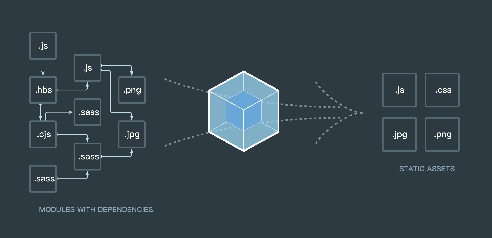
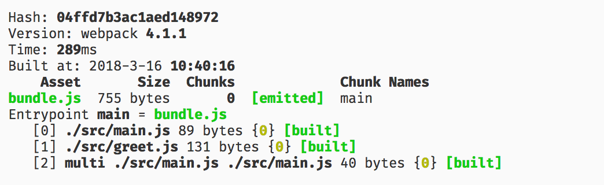
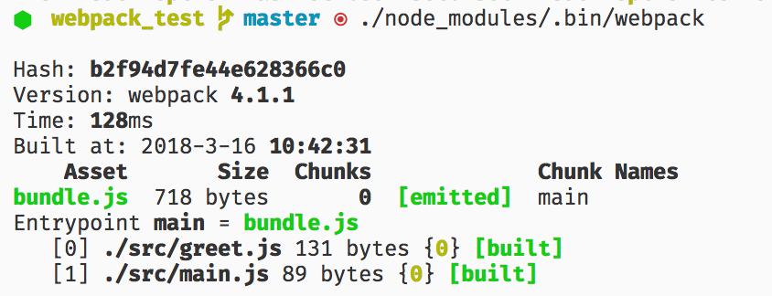

# webpack 入门一

## 为什么要使用 webpack

既然你在看这篇文章，我相信你对 webpack 已经有所耳闻，对 webpack 的作用也有一点理解，不知道 🤔？没关系，且听我慢慢道来...

在 web 开发这片大地上，无数前辈浴血奋战，开辟疆土，扩大着领土范围。随着时间的发展，web 开发不再是简单的页面，而是渐渐往应用的方向发展。它们拥有着复杂的 JavaScript 代码和一大堆依赖，代码之间的关系变得越来复杂，传统的开发、文件管理方式变得力不从心，为了简化开发的复杂度，前端社区涌现出了很多好的实践方法：

* 模块化：一个文件太大，就把文件分开。一个功能太复杂，就把功能拆分实现。这样可以把复杂的程序细化为小的文件，写代码也就变成了搭积木的方式，大大简化了开发难度。
* 类似于 Babel 这种编译器，可以让我们提前享受新的 JavaScript 语法。
* Sass，Less 等 CSS 预处理器，赋予了 CSS 一定的编程能力。
* ...

这些改进确实大大的提高了我们的开发效率，但是利用它们开发的文件往往需要进行额外的处理才能让浏览器识别, 而手动处理又是非常繁琐的，这就为 webpack 类的工具的出现提供了需求。

## webpack 是什么 🤔



> 本质上，webpack 是一个现代 JavaScript 应用程序的静态模块打包器 (module bundler)。当 webpack 处理应用程序时，它会递归地构建一个依赖关系图 (dependency graph)，其中包含应用程序需要的每个模块，然后将所有这些模块打包成一个或多个 bundle。

从官网的介绍中， 我们可以看出 webpack  做的事情很简单：分析并处理应用程序模块之间的依赖，然后将应用程序需要的每个模块打包成一个或多个文件。

webpack 要处理模块之间的依赖，可是怎么处理呢，它怎么知道从哪里开始呢，处理完之后呢？怎么处理呢？这就需要我们指定项目的入口 (entry)，打包完成后的文件放到哪里，也就是出口 (output)，以及处理打包的过程 (loader, plugins)。

😎 现在我们已经理解了 webpack 的功能了，那么我们就开始尝试使用 webpack 吧！

## [webpack 安装](https://doc.webpack-china.org/guides/installation#local-installation) ⚙

> 在开始之前，请确保安装了 Node.js 的最新版本以及 yarn 或者 npm。

新建一个文件， 执行下面命令安装 webpack。

```shell
# 本地安装
yarn add webpack webpack-cli

# 全局安装（一般情况下不建议使用）
# yarn global add webpack
```

### 📝 注意：如果不在命令行使用 webpack，可以不安装 `webpack-cli`。

## 简单使用 webpack 🌰

### 创建测试文件

首先我们要创建一些文件来进行测试：创建 src 目录，在 src 目录下新建 `main.js`、`greet.js` 文件，创建 dist 目录，在 dist 目录下创建 `index.html` 文件。

> dist 通常是代码打包后输出的地方。

greet.js

```JavaScript
module.exports = function() {
  var greet = document.createElement('div');
  greet.innerText = 'hello webpack';
  return greet;
};
```

main.js

```JavaScript
const greet = require('./greet');
document.querySelector('#root').appendChild(greet());
```

index.html

```HTML
<!DOCTYPE html>
<html lang="en">
<head>
  <meta charset="UTF-8">
  <meta name="viewport" content="width=device-width, initial-scale=1.0">
  <meta http-equiv="X-UA-Compatible" content="ie=edge">
  <title>webpack test</title>
</head>
<body>
  <div id="root">
  </div>
  <script src="./bundle.js"></script>
</body>
</html>
```

文件创建完成后，就可以开始打包 (bundle) 测试了。webpack 可以在终端中使用，也可以使用配置文件。

### 在命令行中使用 webpack

命令行中的基本使用方法如下：

```shell
# 全局模式下可以直接使用 webpack
# 本地模式下使用 node_modules 下的 webpack 命令
webpack {entry file} --output {destination for bundled file}

./node_modules/.bin/webpack {entry file} --output {destination for bundled file}
```

运行 webpack 打包命令：

```shell
# Node 8.2+ 版本提供的 npx 命令，可以运行在初始安装的 webpack 包 (package) 的 webpack 二进制文件（./node_modules/.bin/webpack）

npx webpack src/main.js --output dist/bundle.js
```

可以看到下面类似的结果 👇



恭喜 🎉，你已经成功的使用 webpack 打包了一个文件了。不过在命令行进行复杂的操作还是比较麻烦的，大多数项目会需要很复杂的设置，我们可以使用 webpack 的配置文件方法进行打包，这比在命令行中输入大量命令要高效的多。

### 使用配置文件

我们新建一个 `webpack.config.js` 文件，在此文件中写入如下内容：

```JavaScript
const path = require('path');

const config = {
  // 打包的入口文件
  entry: './src/index.js',
  // 打包的出口文件
  output: {
    filename: 'bundle.js',
    path: path.resolve(__dirname, 'dist')
  }
};

// 需要导出配置，且不能使用 es6 的 export
module.exports = config;
```

### 📝 NOTE：`__dirname` 是 node.js 中的一个全局变量，它指向当前执行脚本所在的目录。

有了这个配置之后，再打包文件，只需在终端里运行 webpack(非全局安装需使用 node_modules/.bin/webpack) 命令就可以了，这条命令会自动引用 webpack.config.js 文件中的配置选项，示例如下：

```shell
./node_modules/.bin/webpack
# 或者
npx webpack
```

得到的结果如下：



### NPM 脚本 - 更快捷的执行打包任务

用命令行执行这种方式来运行本地的 webpack 并不是很方便，值得庆幸的是 NPM 可以引导任务执行，对 NPM 进行配置后可以在命令行中使用简单的 `yarn run build` 命令来替代上面略微繁琐的命令。在 `package.json` 中对 scripts 对象进行相关设置即可，设置方法如下：

```json
{
  "name": "webpack-test",
  "version": "1.0.0",
  "main": "index.js",
  "license": "null",
  "scripts": {
    "build": "webpack"
  },
  "dependencies": {
    "webpack": "^4.1.1",
    "webpack-cli": "^2.0.12"
  }
}
```

然后我们直接在命令行中执行 `yarn run build` 即可对文件进行打包，结果我就不列了，和前面的结果类似。

细心的读者可能注意到了，我们这里并没有指定 webpack 的路径，这是为什么呢？

#### 📝 NOTE: `package.json` 中的 `scripts` 会安装一定顺序寻找命令对应位置，本地的 `node_modules/.bin` 路径就在这个寻找清单中，所以无论是全局还是局部安装的 webpack，你都不需要写前面那指明详细的路径了。

关于 npm scripts 的更多内容可以参考 [npm scripts 使用指南](http://www.ruanyifeng.com/blog/2016/10/npm_scripts.html)。

是不是觉得 webpack 似乎也没有那么难？不过也不能轻视 webpack，上面只是简单的使用 webpack，下面我们将介绍 webpack 更多的神奇功能！

下一篇文章 ➡ [webpack 入门二](./webpack_2.md)

### 参考文章 📖

* [入门 Webpack，看这篇就够了](https://segmentfault.com/a/1190000006178770#articleHeader3)
* [官方文档](https://doc.webpack-china.org/guides/getting-started/)