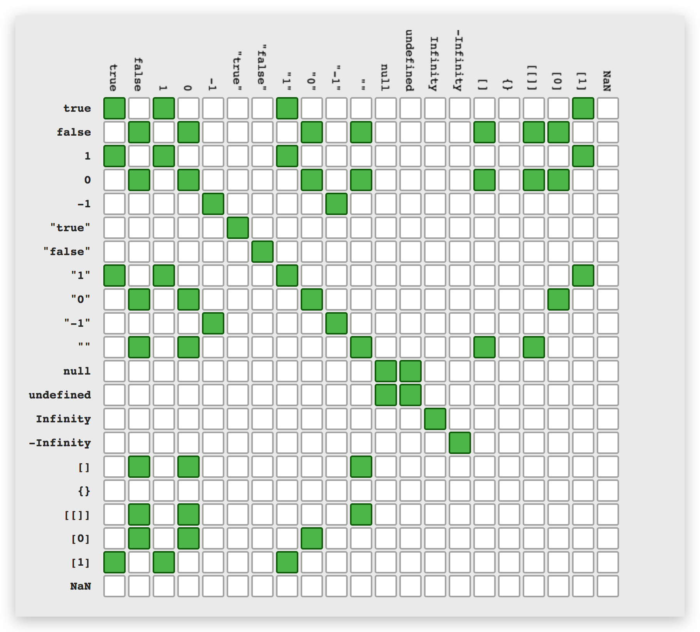

基础部分主要包含 JavaScript 中的基本概念，主要包含

- 语法
- 变量类型
- 语句
- 操作符
- 作用域

## JavaScript 数据类型

JavaScript 有两种数据类型：基本类型和引用类型，基本类型包含 Undefined、Null、Boolean、Number 和 String 等五种值，引用类型有 Object、Array、Function、RegExp、Date 和基本包装类型（Number，Boolean，String）等几种。

## null 和 undefined

`null` 表示此处没有值，是一个特殊的引用对象，典型用法是：

- 作为函数的参数，表示该函数的参数不是对象
- 作为对象原型链的终点

`undefined` 表示还没有定义值。典型用法是：

- 变量被声明了，但没有赋值时，就等于 `undefined`
- 调用函数时，应该提供的参数没有提供，该参数等于 `undefined`
- 对象没有赋值的属性，该属性的值为 `undefined`
- 函数没有返回值时，默认返回 `undefined`。

## 基本类型和引用数据类型

在 JavaScript 中基本类型是按值访问的，可以直接进行修改，拷贝等操作，而引用类型是按引用访问的 ，我们  存在变量  中的也只是一个指向实际值得引用，当我们对变量进行操作时，操作的也不是实际的值而只是值的引用。

- 基本类型的值是不可变，引用类型的值可以改变。
- 引用类型可以添加属性，而基本类型不行。
- 复制时，基本类型复制的是值，而引用类型复制的是引用指针。
- 在传递参数时，基本类型传递的是值，而引用类型传递的是引用指针。

1 是基本类型，Number(1) 是基本包装类型，他们属于不同的类型，使用 typeof 判断时得到的结果也不一样。

```JavaScript
typeof 1 === 'number';
typeof new Number(1) === 'object';
```

PS: Number(1) 为强制类型转化，`typeof Number(1)` 为 `'number'`。

### 扩展

- [undefined 与 null 的区别](http://www.ruanyifeng.com/blog/2014/03/undefined-vs-null.html)
- [JavaScript(三)：基本类型和引用类型的区别](http://www.jianshu.com/p/ec77f3315203)
- [在 javascript 中，1 与 Number(1) 有什么区别](https://segmentfault.com/q/1010000007552319)

## 变量声明提升

变量提升，是指可以在变量未声明时就能访问变量的一种情况，此时变量的值为 undefined。

```Javascript
console.log(a); // undefined
var a = 1;
```

结果将是 `undefined`。

## `==` 和 `===`

`==` 表示相等，在进行比较时会发生类型转换，`===` 表示严格等于，在进行比较时不发生类型转换。使用 `==` 在比较时会转换变量的类型（强制类型转换），将变量转换成相似的类型，再进行比较，如 `'5'` 转换成 `5`，`false` 转换成 `0` 等。使用 `===` 则不会有类型转换，只有两个变量类型相同并且值相等才会返回 `true`。

转换规则

- 如果有一个操作数是布尔值，则在比较相等性之前先将其转换为数值，false 转换为 0，而 true 转换为 1
- 如果一个操作数是字符串，另一个操作数是数值，在比较相等性之前先将字符串转换为数值。
- 如果一个操作数是对象，另一个操作数不是，则调用对象的 valueOf() 方法，用得到的基本类型值按照前面的规则进行比较
- null 和 undefined 是相等的。
- 要比较相等性之前，不能将 null 和 undefined 转换成其他任何值。
- 如果有一个操作数是 NaN，则相等操作符返回 false，而不相等操作符返回 true。即使两个操作数都是 NaN，相等操作符也返回 false。因为按照规则，NaN 不等于 NaN。
- 如果两个操作数都是对象，则比较它们是不是同一个对象。如果两个操作数都指向同一个对象，则相等操作符返回 true；否则，返回 false。

```javascript
// 布尔值转换
false == "false"; // false
false == "0"; // true
true == 1; // true
true == 2; // false

// 字符串转换
"" == "0"; // false
0 == ""; // true
0 == "0"; // true

// undefined，null 和 NaN
false == undefined; // false
false == null; // false
null == undefined; // true
NaN == NaN; // false
NaN != NaN; // true
```

## 宿主对象和原生对象

宿主对象是指 DOM 和 BOM 等由宿主框架通过某种机制注册到 JavaScript 引擎中的对象。原生对象是 Object、Function、Array、String、Boolean、Number、Date、RegExp、Error、Math 等 ECMAScript 官方定义的对象。

## let 和 var

1. var 是函数级作用域，let 是块级作用域。
2. var 存在变量提升，let 不存在变量提升。
3. 因为变量提升的问题，var 在 for 循环中会有闭包引用的问题，而 let 不会存在。

## 判断变量是否数组类型

```JavaScript
if (!Array.isArray){
    Array.isArray = function(arg){
      return Object.prototype.toString.call(arg) === '[object Array]';
    };
}
```

## Object.is() 与 “===”，“==”

两等号判等，会在比较时进行类型转换；运算的规则：

- undefined == null，且它俩与所有其他值比较的结果都是 false。
- String == Boolean，需要两个操作数同时转为 Number。
- String/Boolean == Number，需要 String/Boolean 转为 Number。
- Object == Primitive，需要 Object 转为 Primitive（具体通过 valueOf 和 toString 方法）。三等号判等(判断严格)，比较时不进行隐式类型转换,（类型不同则会返回 false）；
  Object.is 在三等号判等的基础上特别处理了 NaN 、-0 和 +0 ，保证 -0 和 +0 不再相同，Object.is(NaN, NaN) 会返回 true.
  Object.is 应被认为有其特殊的用途，而不能用它认为它比其它的相等对比更宽松或严格。


