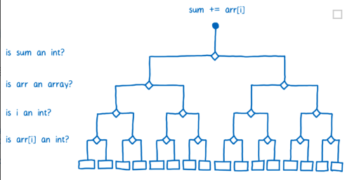

主要关于底层知识的内容。

## 内存回收机制

JavaScript 存在两种内存回收机制，第一种常用的是 `标记清除`，第二种是 `引用计数`。

### 标记清除

- 垃圾回收器生成一个根列表，根通常是将引用保存在代码中的全局变量。在 JavaScript 中，window 对象是一个可以作为根的全局变量。
- 所有的根和子变量都被标记为活跃的，即不会被回收，所有能从根到达的元素也被标记为活跃的，不会被回收。
- 所有没有标记的变量被认为是垃圾，将会被垃圾回收器回收。


### 引用计数

引用计数的思想是根据记录每个变量被引用的次数，当一个变量的引用次数为 0 时，垃圾回收器就可以回收这个变量占用的内存。这个算法可能会遇到诸如循环引用之类的问题，所以不是很常用。

- [如何处理 JavaScript 内存泄露](http://web.jobbole.com/92652/)
- [4 类 JavaScript 内存泄漏及如何避免](https://jinlong.github.io/2016/05/01/4-Types-of-Memory-Leaks-in-JavaScript-and-How-to-Get-Rid-Of-Them/)

### 哪些操作会造成内存泄漏

内存泄漏指任何对象在您不再拥有或需要它之后仍然存在。

垃圾回收器定期扫描对象，并计算引用了每个对象的其他对象的数量。如果一个对象的引用数量为 0（没有其他对象引用过该对象），或对该对象的惟一引用是循环的（两个对象彼此引用且彼此保留），那么该对象的内存即可回收。

- 意外创建（暂存数据）的全局变量
- setTimeout 的第一个参数使用字符串而非函数
- 闭包
- 控制台日志
- DOM 外引用（移除有被引用的节点时要当心）

## 事件执行机制

下面代码的输出结果

```JavaScript
var p1=new Promise(resolve => {
    console.log(1);
    resolve(2);
})
var p2=new Promise(resolve => {
    console.log(3);
    resolve(p1);
})
p1.then(re => {
    console.log(re);
})
p2.then(re => {
    console.log(re);
})
```

我们都知道 JavaScript 是单线程执行的，单线程就意味着，所有任务需要排队，前一个任务结束，才会执行后一个任务。如果前一个任务耗时很长，后一个任务就不得不一直等着，这显然会造成不好的用户体验，用户可不会愿意  看到点击了某个按钮之后，网页直接卡死。

> 为了利用多核 CPU 的计算能力，HTML5 提出 Web Worker 标准，允许 JavaScript 脚本创建多个线程，但是子线程完全受主线程控制，且不得操作 DOM。所以，这个新标准并没有改变 JavaScript 单线程的本质。

于是，一种事件循环机制诞生了（假设是这样 🤓）...JavaScript 语言的设计者意识到，主线程完全可以不管 IO 等耗时操作，挂起处于等待中的任务，先运行排在后面的任务。等到 IO 等耗时操作返回了结果，再回过头，把挂起的任务继续执行下去。

于是，所有任务可以分成两种，一种是同步任务（synchronous），另一种是异步任务（asynchronous）。同步任务指的是，在主线程上排队执行的任务，只有前一个任务执行完毕，才能执行后一个任务。异步任务指的是，不进入主线程、而进入 "任务队列"（task queue）的任务，只有 "任务队列" 通知主线程，某个异步任务可以执行了，该任务才会进入主线程执行。

具体来说，异步执行的运行机制如下。（同步执行也是如此，因为它可以被视为没有异步任务的异步执行。）

1. 所有同步任务都在主线程上执行，形成一个执行栈（execution context stack）。

2. 主线程之外，还存在一个 "任务队列"（task queue）。只要异步任务有了运行结果，就在 "任务队列" 之中放置一个事件。

3. 一旦 "执行栈" 中的所有同步任务执行完毕，系统就会读取 "任务队列"，看看里面有哪些事件。那些对应的异步任务，于是结束等待状态，进入执行栈，开始执行。

4. 主线程不断重复上面的第三步。

在浏览器和 Node 里，JavaScript 都是单线程执行的，但是浏览器和 Node 中的事件循环（Event Loop ）和执行机制不同，不能混为一谈。浏览器的事件循环是在 HTML5 中定义的规范，而 Node 中则由 libuv 库实现。

### 任务队列

在浏览器中，异步任务分为 macrotask 和 microtask（微任务）两类。
当满足执行条件时，macrotask 和 microtask 会被放入各自的队列中等待放入主线程执行，我们把这两个队列称为 Macrotask Queue 和 Microtask Queue。

- macrotask：script 中代码、setTimeout、setInterval、I/O、UI render。
- microtask: promise、Object.observe、MutationObserver。

执行过程

1. 执行完主执行线程中的任务。
2. 取出 Microtask Queue 中任务执行直到清空。
3. 取出 Macrotask Queue 中一个任务执行。
4. 取出 Microtask Queue 中任务执行直到清空。
5. 重复 3 和 4。

即为同步完成，一个宏任务，所有微任务，一个宏任务，所有微任务......


📝 注意

- 在浏览器页面中可以认为初始执行线程中没有代码，每一个 script 标签中的代码是一个独立的 task，即会执行完前面的 script 中创建的 microtask 再执行后面的 script 中的同步代码。
- 如果 microtask 一直被添加，则会继续执行 microtask，“卡死” macrotask。
- 部分版本浏览器有执行顺序与上述不符的情况，可能是不符合标准或 js 与 html 部分标准冲突。
- promise 的 then 和 catch 才是 microtask，本身的内部代码不是。

### 参考

- [JavaScript 运行机制详解：再谈 Event Loop](http://www.ruanyifeng.com/blog/2014/10/event-loop.html)
- [浏览器和 Node 不同的事件循环（Event Loop）](https://segmentfault.com/a/1190000013660033)
- [详解 JavaScript 中的 Event Loop（事件循环）机制](https://zhuanlan.zhihu.com/p/33058983)
- [JS 异步原理 (事件, 队列)](https://segmentfault.com/a/1190000010913949)

## 执行环境和作用域链

### 执行上下文

执行环境或执行上下文（execution context）是 JavaScript 中最为重要的一个概念。执行环境定义了变量或函数有权访问的其他数据，决定了它们各自的行为。每个执行环境都有一个与之关联的变量对象（variable object），环境中定义的所有变量和函数都保存在这个对象中，全局执行环境是最外围的一个执行环境。

每个函数都有自己的执行环境。当执行流进入一个函数时，函数的环境就会被推入一个环境栈中。 而在函数执行之后，栈将其环境弹出，把控制权返回给之前的执行环境。ECMAScript 程序中的执行流正是由这个方便的机制控制着。

### 变量对象

变量对象是与执行上下文相关的数据作用域，存储了在上下文中定义的变量和函数声明。

全局对象是预定义的对象，作为 JavaScript 的全局函数和全局属性的占位符。通过使用全局对象，可以访问所有其他所有预定义的对象、函数和属性。

在函数上下文中，我们用活动对象(activation object, AO)来表示变量对象。活动对象和变量对象其实是一个东西，只是变量对象是规范上的或者说是引擎实现上的，不可在 JavaScript 环境中访问，只有到当进入一个执行上下文中，这个执行上下文的变量对象才会被激活，所以才叫 activation object 呐，而只有被激活的变量对象，也就是活动对象上的各种属性才能被访问。

### 执行过程

执行上下文的代码会分成两个阶段进行处理：分析和执行，我们也可以叫做：

1. 进入执行上下文
2. 代码执行

#### 进入执行上下文

当进入执行上下文时，这时候还没有执行代码，主要是生成变量对象，变量对象会包括：

- 函数的所有形参 (如果是函数上下文)

  - 由名称和对应值组成的一个变量对象的属性被创建
  - 没有实参，属性值设为 `undefined`

- 函数声明

  - 由名称和对应值（函数对象(function-object)）组成一个变量对象的属性被创建
  - 如果变量对象已经存在相同名称的属性，则完全替换这个属性

- 变量声明

  - 由名称和对应值（undefined）组成一个变量对象的属性被创建
  - 如果变量名称跟已经声明的形式参数或函数相同，则变量声明不会干扰已经存在的这类属性

**主要的地方是生成变量对象时，函数会覆盖同名的变量**

#### 代码执行

在代码执行阶段，会顺序执行代码，根据代码，修改变量对象的值。

#### 例子

```js
// 输出 foo 函数
console.log(foo);

function foo() {
  console.log("foo");
}

var foo = 1;
```

执行代码前会先创建变量对象，这时，变量对象中，foo 为函数，当代码顺序执行时，就会输出函数。

### 作用域链

**作用域链**，是由当前环境与上层环境的一系列变量对象组成，它保证了当前执行环境对符合访问权限的变量和函数的有序访问。当代码在一个环境中执行时，会创建变量对象的一个作用域链（scope chain）。当需要从局部函数查找某一属性或方法时，如果当前作用域没有找到，就会上溯到上层作用域查找，直至全局函数，这种组织形式就是作用域链。

核心就是: 函数的作用域在函数定义的时候就决定了，JavaScript 是采用词法作用域的，这就意味着函数的执行依赖于函数定义的时候所产生（而不是函数调用的时候产生的）的变量作用域，为了去实现这种词法作用域，JavaScript 函数对象的内部状态不仅包含函数逻辑的代码，除此之外还包含当前作用域链的引用。

## JIT (just-in-time) Compiler

### 解释与编译

我们都了解语言执行引擎的作用：将人类可以理解的语言转换成机器能理解并执行的语言。而转换大致可以分为两种：解释型和编译型，解释型会在代码执行时一行行的进行转换，而编译型并不会这样，他会提前进行转换，并将转换结果存储下来。

#### 解释型转换的优点与缺点

解释器可以快速启动执行，不用经历漫长的编译过程。因此，解释器更适合像 JavaScript 这种语言，对于 Web 开发人员来说，能够快速开始执行程序很重要。

但是，当你多次运行同样的程序时，比如循环，解释器的缺点就会暴露出来，它需要一次又一次的重复同样的转换工作，这样显然会造成性能低下。

#### 编译型转换的优点与缺点

编译器则会有相反的情况，它必须在开始时完成编译步骤，需要花费更多的启动时间。但是在循环这样的场景中会有更好的表现，因为它不需要进行重复转换工作。

另一个不同之处是编译器有更多的时间来查看代码并对其进行优化，这样它会运行得更快。

### JIT，更好的选择

为了摆脱解释器效率低下的问题：解释器每次循环都必须不断地重新翻译代码，浏览器开始将编译器引入进行。

#### 分析标记

不同的浏览器的实现可能有所不同，但是基本原理是一致的。添加了一个新的部分到 JavaScript 引擎中，称之为监控器（monitor），又名性能分析器。监视器在运行时监视代码，并记录代码运行的次数和使用的类型。一开始，监视器或执行完全部代码，当同样的代码被执行多次之后，会被标记为 warn，当执行很多次之后，会被标记为 hot。

#### 编译

如果一段代码被标记为 "warm"，JIT 会将这段代码进行编译，并存储编译后的结果。代码的每一行会被编译成一个 "stub"（可以理解为对象似的存储），"stub" 会根据行数和变量类型进行索引，当监视器发现需要再次执行相同的代码时，他会使用编译后的版本来代替这段代码执行。

#### 编译优化

如果一段代码被标记为 "hot"，监视器会把它发送到优化编译器中，生成一个更快速和高效的代码版本出来，并且存储起来。

#### 去优化

为了生成更快速的代码，编译器需要做一些假设，例如，可以假设由同一个特定构造器生成的对象都拥有同样的结构，它们拥有同样的属性，相同的排列顺序。优化编译器使用监视器通过观察代码执行所收集的信息来做出这些判断，比如在一个循环中，如果某件事之前所有的执行都是 true，那么可以假设它将继续是 true。然而，对于 JavaScript 来说，没有什么是可以保证的，可能前 99 个对象结构相同，第 100 个对象却缺少一个属性。

因此，编译后的代码需要在运行之前进行检查，看看这些假设是否有效。如果是，则运行编译后的代码，如果没有，JIT 会假设它做了错误的假设，并破坏了优化的代码，JIT 会继续执行优化之前的编译版本，这个过程被称为去优化。

通常优化编译器会使代码更快，但有时它们会导致意想不到的性能问题。如果你的代码不断优化，然后又去优化，那么它最终会比仅仅执行基础的编译版本更慢。大多数浏览器都增加了一些限制，以在优化/去优化周期发生解决可能发生的性能问题，如果 JIT 已经进行了 10 次以上的优化尝试，并且一直不得不放弃优化，那么它将停止再次优化。

#### 举个例子：类型优化

优化的类型有很多，但我只演示其中一种，以便你理解优化是如何发生的，优化编译器最大的成功之一来自于类型专门化。

JavaScript 使用的动态类型系统在运行时需要多做一些额外的工作。例如下面这段代码：

```js
function arraySum(arr) {
  var sum = 0;
  for (var i = 0; i < arr.length; i++) {
    sum += arr[i];
  }
}
```

执行循环中的 `+=` 一步似乎很简单，看起来你可以一步就得到计算结果，但由于 JavaScript 的动态类型，处理它所需要的步骤比你想象的多。假定 `arr` 是一个存放 100 个整数的数组，在代码执行几次后，编译器将为函数中的每个操作创建一个 "stub"，`sum += arr[i]` 将会有一个把 `+=` 依据整数加法处理的 "stub"。

然而我们并不能保证 `sum` 和 `arr[i]` 一定是整数。因为在 JavaScript 中数据类型是动态的，有可能在下一次循环中的 `arr[i]` 是一个字符串。整数加法和字符串拼接是两个完全不同的操作，因此也会编译成非常不同的机器码。

JIT 处理这种情况的方法是编译多个 "stub"，一段代码如果是单态的（即总被同一种类型调用），将得到一个 "stub"，如果是多态的（即被不同类型调用），那么它将得到分别对应各类型组合操作的 "stub"，这意味着 JIT 在确定 "stub" 要问许多问题



在编译器中，由于每一行代码都有各自对应的 "stub"，每次代码运行时，JIT 要不断检查该行代码的操作类型，因此在每次循环时，JIT 都要询问相同的问题。如果 JIT 不需要重复这些检查，代码运行速度会加快很多，这就是优化编译器的工作之一了。在优化编译器中，整个函数会被一起编译，所以类型检查可以在循环开始前完成。

一些 JIT 编译器做了进一步优化。例如，在 Firefox 中为仅包含整数的数组设立了一个特殊分类，如果 `arr` 是在这个分类下的数组，JIT 就不需要检查 `arr[i]` 是否是整数了，这意味着 JIT 可以在进入循环前完成所有类型检查。

### 总结

简而言之，这就是 JIT。它通过监控代码运行确定高频代码，并进行优化，加快了 JavaScript 的运行速度，因此令大多数 JavaScript 应用程序的性能提高了数倍。

即使有了这些改进，JavaScript 的性能仍是不可预测的。为了加速代码运行，JIT 在运行时增加了以下开销：

- 优化和去优化
- 用于存储监视器纪录和应急回退时的恢复信息的内存
- 用于存储代码编译和优化版本的内存

### 参考

- [JavaScript 深入之词法作用域和动态作用域](https://github.com/mqyqingfeng/Blog/issues/3)
- [JavaScript 深入之变量对象](https://github.com/mqyqingfeng/Blog/issues/5)
- [JavaScript 深入之作用域链](https://github.com/mqyqingfeng/Blog/issues/6)
- [前端基础进阶（四）：详细图解作用域链与闭包](http://web.jobbole.com/90524/)
- [A crash course in just-in-time (JIT) compilers](https://hacks.mozilla.org/2017/02/a-crash-course-in-just-in-time-jit-compilers/)
