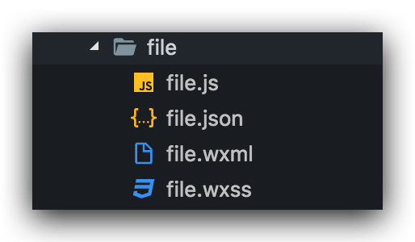
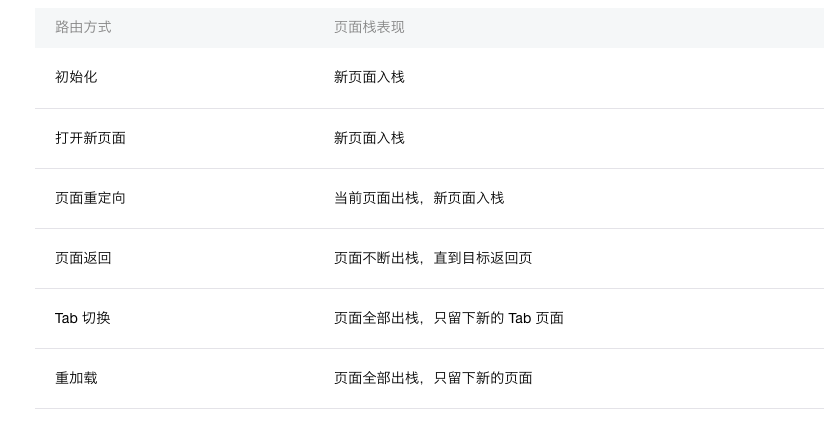
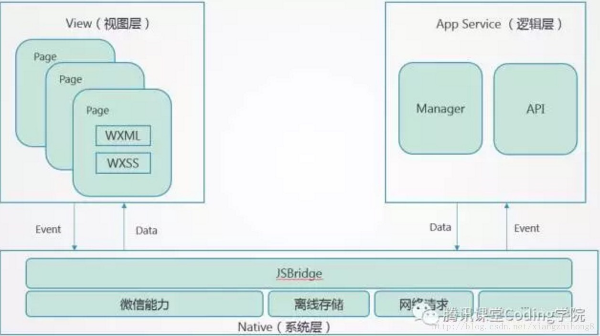

# 小程序基础

简单了解小程序。

## 前期准备

开发小程序的第一步，你需要拥有一个小程序帐号，通过这个帐号管理你的小程序以及进行开发。然后，你需要一个趁手的工具，这里只能推荐小程序的官方开发工具，虽然这个开发工具体验不怎么好，还会莫名奇妙各种卡死，但是也没有其他更好的选择，直接官方文档走起：[链接](https://developers.weixin.qq.com/miniprogram/dev/quickstart/basic/getting-started.html)

## 初步了解

小程序中有四种基本类型文件，每种类型的文件都有不同的作用：

- `.json` 后缀的 JSON 配置文件
- `.wxml` 后缀的 WXML 模板文件
- `.wxss` 后缀的 WXSS 样式文件
- `.js` 后缀的 JS 脚本逻辑文件

### JSON 配置文件

JSON 文件一般包含的是项目中的配置文件，通常有三种不同的配置文件：

1. 小程序配置 app.json

app.json 是对当前小程序的全局配置，包括了小程序的所有页面路径、界面表现、网络超时时间、底部 tab 等。

```json
{
  "pages": ["pages/index/index", "pages/logs/logs"],
  "window": {
    "backgroundTextStyle": "light",
    "navigationBarBackgroundColor": "#fff",
    "navigationBarTitleText": "WeChat",
    "navigationBarTextStyle": "black"
  }
}
```

2. 工具配置 project.config.json

包含对开发工具的一些个性化配置，如界面颜色，编译配置等，方便进行迁移，同步编辑器配置。当你重新安装工具或者换电脑工作时，你只要载入同一个项目的代码包，开发者工具就自动会帮你恢复到当时你开发项目时的个性化配置，其中会包括编辑器的颜色、代码上传时自动压缩等等一系列选项。

3. 页面配置 page.json

page.json 包含了对页面的配置，可以独立定义每个页面的一些属性，例如刚刚说的顶部颜色、是否允许下拉刷新等等。

### WXML 模板

WXML 在小程序中的地位相当于 HTML，主要用于页面结构的构建。当然 WXML 包含许多 HTML 没有的特性，但是大致使用方法还是类似的。如果你学习过 Vue，那么你会发现 WXML 的语法和 Vue 的模板语法非常相似，看个 demo：

```html
<view class="container">
  <view class="userinfo">
    <button wx:if="{{!hasUserInfo && canIUse}}"> 获取头像昵称 </button>
    <block wx:else>
      <image src="{{userInfo.avatarUrl}}" background-size="cover"></image>
      <text class="userinfo-nickname">{{userInfo.nickName}}</text>
    </block>
  </view>
  <view class="usermotto">
    <text class="user-motto">{{motto}}</text>
  </view>
</view>
```

和 HTML 非常相似，有标签、属性等等构成。但是也有很多不一样的地方，我们来一一阐述一下：

- 不同于 HTML 中的 div，p 等标签，小程序以组件作为基本的元素，用以构建页面结构，并且提供了很多基本的组件，如视图 `view`，文本 `text`，图片 `image` 等，大大提升了开发效率。全部组件 [🔗](https://developers.weixin.qq.com/miniprogram/dev/component/)
- 多了一些 `wx:if` 这样的属性以及 `{{}}` 这样的表达式，和 Vue 中 v-if 以及模板语法的作用是一致的。

### WXSS 样式

WXSS 具有 CSS 大部分的特性，小程序在 WXSS 也做了一些扩充和修改。

- 新增了尺寸单位。在写 CSS 样式时，开发者需要考虑到手机设备的屏幕会有不同的宽度和设备像素比，采用一些技巧来换算一些像素单位。WXSS 在底层支持新的尺寸单位 rpx ，开发者可以免去换算的烦恼，只要交给小程序底层来换算即可，由于换算采用的浮点数运算，所以运算结果会和预期结果有一点点偏差。
- 提供了全局的样式和局部样式。和前边 app.json, page.json 的概念相同，你可以写一个 app.wxss 作为全局样式，会作用于当前小程序的所有页面，局部页面样式 page.wxss 仅对当前页面生效。
- 此外 WXSS 仅支持部分 CSS 选择器：`.class`，`#id`，`element`，`::after`，`::before`。

**注意：定义在 page 中的局部样式会覆盖全局样式。**

### JS 交互逻辑

小程序中的 JS 就和我们平常使用的 JS 差不多，基本语法一致，不过全局变量改变了，`window` 不再存在，取而代之的是 `wx` 。`wx` 与 `window` 的作用类似，负载了在小程序开发中常用的 API，与 `window` 的 API 毫无关系，不要想当然的在小程序中使用 `window` 上的 API。小程序开发框架提供丰富的微信原生 API，可以方便的调起微信提供的能力，如获取用户信息，本地存储，支付功能等。关于 API 的使用请看官方文档 [🔗](https://developers.weixin.qq.com/miniprogram/dev/api/)

此外，小程序中的 JS 还支持模块化加载，与 Node 模块化语法类似，通过 `module.exports` 暴露模块接口，通过 `require` 引入模块。

注意：

- 小程序目前不支持直接引入 `node_modules` , 使用 node_modules 时需要拷贝出相关的代码到小程序的目录中。
- require 暂时不支持绝对路径

## 页面与路由

### 页面

在小程序中，一个页面通常由 4 种文件组成，即前面提到的 4 种基本类型文件，包含页面的结构，样式，逻辑交互和[配置](https://developers.weixin.qq.com/miniprogram/dev/framework/config.html)，4 种文件的名字必须一致，即页面的名字，通常放在一个文件夹中，如下所示：



在 JS 文件中使用 Page() 函数来进行页面注册，Page() 函数用来注册一个页面，接受一个 [object 参数](https://developers.weixin.qq.com/miniprogram/dev/framework/view/)，其指定页面的初始数据、生命周期函数、事件处理函数等。`data` 中存放页面的数据，包含模板中需要使用的数据，更新 data 中的数据时要使用 `setData` 函数，否则页面不会自动更新。

Page 包含许多周期函数，分别对应着页面存在的不同时期，如 `onLoad: 页面加载`， `onShow: 页面显示`，`onUnload: 页面卸载` 等。我们可以使用生命周期函数，在不同的时期对页面进行操作，如在 `onLoad` 中异步加载数据。

除了生命周期函数之外，小程序也内置了一些和页面有关的其他函数，如下拉刷新监听函数 `onPullDownRefresh`，页面滚动监听函数 `onPageScroll` 等。当然我们也可以定义自己的函数，用于处理页面逻辑，自定义函数直接写在 page 接受的对象中。

```javascript
// 示例代码
Page({
  onLoad: function () {
    this.setData({
      savedFilePath: wx.getStorageSync('savedFilePath')
    })
  },
  data: {
    tempFilePath: '',
    savedFilePath: '',
    dialog: {
      hidden: true
    }
  },
  confirm: function () {
    this.setData({
      'dialog.hidden': true
    })
  }
})
```

### 路由

在小程序中所有页面的路由全部由框架进行管理，不需要我们做太多关于路由的工作，只需要定义页面，然后就可以直接使用路由了。

框架以栈的形式维护了当前的所有页面。 当发生路由切换的时候，页面栈的表现如下：



#### 定义页面

小程序的页面定义配置在 app.json 文件中，用 `pages` 字段表示。`pages` 接受一个数组，每一项都是字符串，来指定小程序由哪些页面组成。每一项代表对应页面的【路径+文件名】信息，数组的第一项代表小程序的初始页面。小程序中新增/减少页面，都需要对 pages 数组进行修改。文件名不需要写文件后缀，因为框架会自动去寻找路径下 .json, .js, .wxml, .wxss 四个文件进行整合。

```json
{
  "pages":[
    "pages/files/files",
  ]
}
```

#### 路由导航

小程序提供了一些基本的导航 API 完成页面跳转，同时也提供了具有相同功能的组件。

- 打开新页面：调用 API `wx.navigateTo` 或使用组件 `<navigator open-type="navigateTo"/>`
- 页面重定向：调用 API `wx.redirectTo` 或使用组件 `<navigator open-type="redirectTo"/>`
- 页面返回：调用 API `wx.navigateBack` 或使用组件 `<navigator open-type="navigateBack">`
- Tab 切换：调用 API `wx.switchTab` 或使用组件 `<navigator open-type="switchTab"/>`
- 重启动：调用 API `wx.reLaunch` 或使用组件 `<navigator open-type="reLaunch"/>`

**注意：navigateTo, redirectTo 只能打开非 tabBar 页面。switchTab 只能打开 tabBar 页面。**

**注意：目前页面路径最多只能十层。**

#### 路由传参

路由传参是一项很重要的功能，处于各种各样的原因，我们会需要通过路由信息传递参数，路由传参也是页面之间进行数据交互的基本方法。在小程序中进行路由传参十分简单，只需要在 url 后面通过 `query` 添加参数即可，如：

```js
wx.navigateTo({
  url: 'test?id=1'
})
```

使用时，可以在对应页面的 `onLoad` 生命周期函数中取出：

```js
onLoad: function(option) {
  console.log(option.query);
}
```

## WXS 语法

WXS（WeiXin Script）是小程序的一套脚本语言，与 JavaScript 不同，WXS 有自己的语法，并且 WXS 的运行环境与 JavaScript 代码是隔离的，WXS 中不能调用其他 JavaScript 文件中定义的函数，也不能调用小程序提供的 API，WXS 函数不能作为组件的事件回调。由于运行环境的差异，在 iOS 设备上小程序内的 WXS 会比 JavaScript 代码快 2 ~ 20 倍，在 Android 设备上二者运行效率无差异。


```html
<!--wxml-->
<wxs module="m1">
var msg = "hello world";

module.exports.message = msg;
</wxs>

<view> {{m1.message}} </view>
```

从语法上来说，WXS 是简略版的 JavaScript，支持部分 JavaScript 语法，数据类型以及内置函数。语法上没有什么好说，具体可见官方文旦 [🔗](https://developers.weixin.qq.com/miniprogram/dev/framework/view/wxs/)。

我们需要理解的是 WXS 存在的意义，从其形式上来看，其与 `script` 标签中的 JavaScript 十分类似，提供了在 WXML 中书写 JavaScript 的能力，可以完成一些简单的逻辑操作。主要来说，WXS 增强了 WXML 标签的表达能力，同时由于运行环境的问题，WXS 也存在一定性能上的优势。至于怎么用，用不用，完全取决于个人爱好了。

## WXML 与模板

### WXML 模板

WXML 提供模板（template），可以在模板中定义代码片段，然后在不同的地方调用。模板是简短的 WXML 代码片段，可以方便的在 WXML 中复用，减少代码的复杂性。

定义模板

```html
<template name="msgItem">
  <view>
    <text> {{index}}: {{msg}} </text>
    <text> Time: {{time}} </text>
  </view>
</template>
```

使用模板

```html
<template is="msgItem" data="{{...item}}"/>
<!-- 动态使用模板  -->
<template is="{{item % 2 == 0 ? 'even' : 'odd'}}"/>
```

### WXML 模板引用

通过 WXML 提供的文件引用方式，我们可以直接在 WXML 中引用另一个 WXML 文件。WXML 提供了两种文件引用方式 `import` 和`include`。

#### import

import 可以在该文件中使用目标文件定义的 template，如：

```html
<!-- item.wxml -->
<template name="item">
  <text>{{text}}</text>
</template>

<!-- import.wxml -->
<import src="item.wxml"/>
<template is="item" data="{{text: 'forbar'}}"/>
```

**注意：import 有作用域的概念，即只会 import 目标文件中定义的 template，而不会 import 目标文件 import 的 template。** 
>如：C import B，B import A，在 C 中可以使用 B 定义的 `template ，在 B 中可以使用 A 定义的 `template`，但是 C 不能使用 A 定义的 `template`。

#### include

include 可以将目标文件除了 `<template/>` ，`<wxs/>` 外的整个代码引入，相当于是拷贝到 include 位置，如：

```html
<!-- header.wxml -->
<view> header </view>
<!-- footer.wxml -->
<view> footer </view>

<!-- index.wxml -->
<include src="header.wxml"/>
<view> body </view>
<include src="footer.wxml"/>
```

相当于：

```html
<!-- footer.wxml -->
<view> header </view>
<view> body </view>
<view> footer </view>
```

## 自定义组件

在现代的 Web 开发中，组件式开发已经不是什么新鲜的事情了，组件式开发的好处也显而易见。从小程序基础库版本 1.6.3 开始，小程序支持简洁的组件化编程，所有自定义组件相关特性都需要基础库版本 1.6.3 或更高。小程序中的组件和其他框架中的组件本质上是一样，拥有自己的样式和结构以及交互逻辑。

### 定义组件

类似于页面，一个自定义组件由 4 种基本类型的文件组成。要编写一个自定义组件，首先需要在 JSON 文件中进行自定义组件声明（将 component 字段设为 true）：

```json
{
  "component": true
}
```

然后，在 JS 文件中使用 `Component()` 来注册组件，并提供组件的属性定义、内部数据和自定义方法等。`Component` 构造器提供了许多选项，可以指定组件的属性，数据和方法等，详细选项参考官方文档[🔗](https://developers.weixin.qq.com/miniprogram/dev/framework/custom-component/component.html)

```javascript
Component({
  properties: {
    // 这里定义了innerText属性，属性值可以在组件使用时指定
    innerText: {
      type: String,
      value: 'default value',
    }
  },
  data: {
    // 这里是一些组件内部数据
    someData: {}
  },
  methods: {
    // 这里是一个自定义方法
    customMethod: function(){}
  }
})
```

**注意：在组件 WXSS 中不应使用ID选择器、属性选择器和标签名选择器。**

### 使用组件

使用已注册的自定义组件前，首先要在页面的 JSON 文件中进行引用声明。此时需要提供每个自定义组件的标签名和对应的自定义组件文件路径：

```json
{
  "usingComponents": {
    "component-tag-name": "path/to/the/custom/component"
  }
}
```

这样，在页面的 WXML 中就可以像使用基础组件一样使用自定义组件。节点名即自定义组件的标签名，节点属性即传递给组件的属性值。

```html
<view>
  <component-tag-name inner-text="Some text"></component-tag-name>
</view>
```

- 因为WXML节点标签名只能是小写字母、中划线和下划线的组合，所以自定义组件的标签名也只能包含这些字符。
- 自定义组件也是可以引用自定义组件的，引用方法类似于页面引用自定义组件的方式（使用 usingComponents 字段）。
- 自定义组件和使用自定义组件的页面所在项目根目录名不能以“wx-”为前缀，否则会报错。

### slot

在组件模板中可以提供一个 `<slot>` 节点，用于承载引用组件提供的子节点。

```html
<!-- 组件模板 -->
<view class="wrapper">
  <view>组件内部节点</view>
  <slot></slot>
</view>
```

```html
<!-- 引用组件的页面模版 -->
<view>
  <component-tag-name>
    <!-- 这部分内容将被放置在组件 <slot> 的位置上 -->
    <view>插入到组件 slot 中的内容</view>
  </component-tag-name>
</view>
```

将渲染为：

```html
<view>
  <view class="wrapper">
    <view>组件内部节点</view>
    <view>插入到组件 slot 中的内容</view>
  </view>
</view>
```

### 组件事件

在使用组件时，我们不仅可以通过属性传递数据，还可以向组件传递函数，然后在组件内部使用或这些函数。自定义组件可以触发任意的事件，引用组件的页面可以监听这些事件，监听自定义组件事件的方法与监听基础组件事件的方法完全一致。

```html
<!-- 当自定义组件触发 myevent 事件时，调用“onMyEvent”方法 -->
<component-tag-name bindmyevent="onMyEvent" />
<!-- 或者可以写成 -->
<component-tag-name bind:myevent="onMyEvent" />
```

自定义组件触发事件时，需要使用 `triggerEvent` 方法，指定事件名、`detail` 对象和事件选项，事件选项指定了事件的一些属性，如是否冒泡，是否拥有捕获阶段等。

```javascript
Component({
  properties: {}
  methods: {
    onTap: function(){
      var myEventDetail = {}; // detail对象，提供给事件监听函数
      var myEventOption = {}; // 触发事件的选项
      this.triggerEvent('myevent', myEventDetail, myEventOption);
    }
  }
})
```

## 分包加载

某些情况下，开发者需要将小程序划分成不同的子包，在构建时打包成不同的分包，用户在使用时按需进行加载。

在构建小程序分包项目时，构建会输出一个或多个功能的分包，其中每个分包小程序必定含有一个主包，所谓的主包，即放置默认启动页面/TabBar 页面，以及一些所有分包都需用到公共资源/JS 脚本，而分包则是根据开发者的配置进行划分。

在小程序启动时，默认会下载主包并启动主包内页面，如果用户需要打开分包内某个页面，客户端会把对应分包下载下来，下载完成后再进行展示。

目前小程序分包大小有以下限制：

- 整个小程序所有分包大小不超过 8M
- 单个分包/主包大小不能超过 2M

对小程序进行分包，可以优化小程序首次启动的下载时间，以及在多团队共同开发时可以更好的解耦协作。

## 框架

小程序的原生开发体验并不友好，由此衍生了许多框架来弥补小程序原生开发中的各种问题，这里推荐几个框架：

- [wepy](https://tencent.github.io/wepy/document.html)：腾讯开源的框架，优化了组件化开发体验。
- [mpvue](http://mpvue.com/mpvue/) 美团开源的框架，使用了 Vue 语法进行开发，需要对 Vue 有一定的了解。
- [Taro](https://github.com/NervJS/taro) 京东凹凸实验室开源的基于 React 语法的框架。

框架的选择看个人喜好，在选择使用之前最好先了解一下该框架的优点和缺点，以及框架中可能存在的坑，再做出自己的决定。

## 踩坑

### 开发工具与真机效果不一致

1. 下拉刷新，在开发工具中会自动终止。
2. 某些布局，如 `absolute`，真机显示效果**可能**会与开发工具不一致，要看具体情况。
3. 获取临时文件地址时，开发工具与真机的地址时不同的，在开发工具上能使用的地址，可能在真机上就无法使用。

## 微信小程序原理

微信小程序的框架包含两部分 View 视图层、App Service 逻辑层，View 层用来渲染页面结构，AppService 层用来逻辑处理、数据请求、接口调用，它们在两个进程（两个Webview）里运行。视图层和逻辑层通过系统层的 JSBridge 进行通信，逻辑层把数据变化通知到视图层，触发视图层页面更新，视图层把触发的事件通知到逻辑层进行业务处理。

小程序架构图：



小程序的 UI 视图和逻辑处理是用多个 Webview 实现的，逻辑处理的 JS 代码全部加载到一个 Webview 里面，称之为AppService，整个小程序只有一个，并且整个生命周期常驻内存，而所有的视图都是单独的 Webview来承载，称之为 AppView。所以一个小程序打开至少就会有2个 Webview 进程，正式因为每个视图都是一个独立的 Webview 进程，考虑到性能消耗，小程序不允许打开超过5个层级的页面，当然同是也是为了体验更好。

### 参看

- [小程序实现原理解析](https://cloud.tencent.com/developer/article/1029663)
