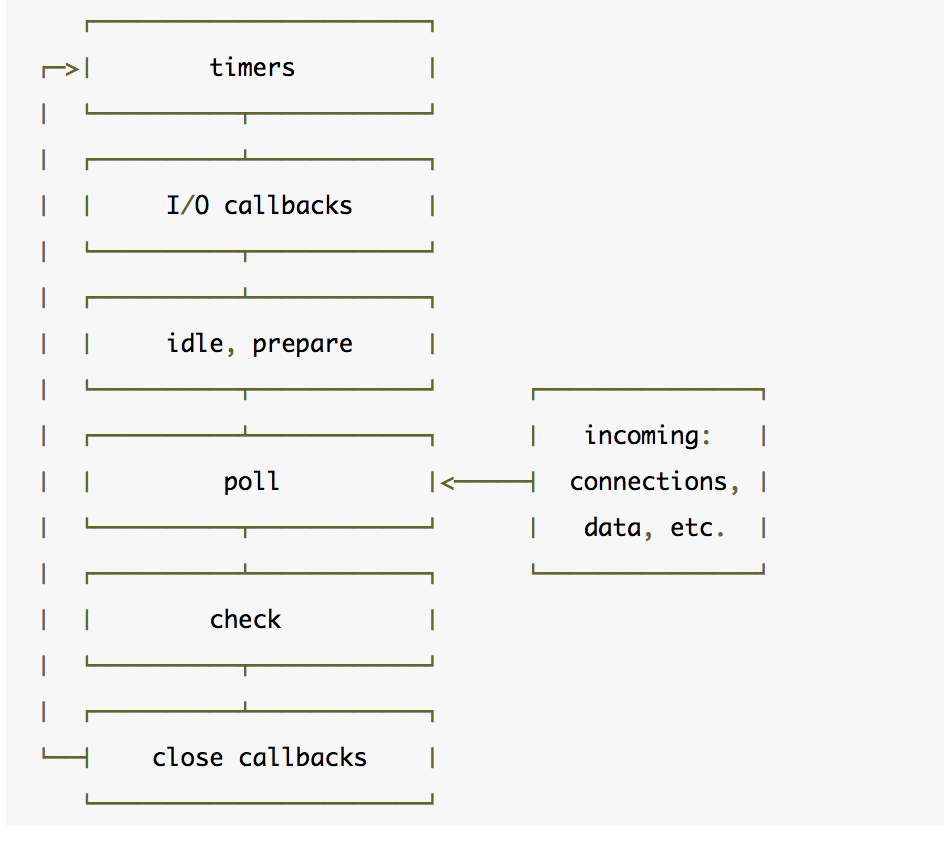

## 任务队列

Node 事件循环阶段示意图：

阶段说明：

- timers 阶段: 这个阶段执行 setTimeout(callback) 和 setInterval(callback)预定的 callback
- I/O callbacks 阶段: 执行除了 close 事件的 callbacks、被 timers(定时器，setTimeout、setInterval 等)设定的 callbacks、setImmediate()设定的 callbacks 之外的 callbacks
- idle, prepare 阶段: node 内部的一些调用
- poll 阶段: 获取新的 I/O 事件，适当的条件下 node 将阻塞在这里
- check 阶段: 执行 setImmediate() 设定的 callbacks
- close callbacks 阶段: 比如 socket.on(‘close’, callback)的 callback 会在这个阶段执行

### timers

一个 timer 指定一个下限时间而不是准确时间，在达到这个下限时间后执行回调。在指定的时间过后，timers 会尽早的执行回调，但是系统调度或者其他回调的执行可能会延迟它们。

> 从技术上来说，poll 阶段控制 timers 什么时候执行，而执行的具体位置在 timers。

下限的时间有一个范围：[1, 2147483647]，如果设定的时间不在这个范围，将被设置为 1。

### I/O callbacks

这个阶段执行一些系统操作的回调，比如说 TCP 连接发生错误。

### idle, prepare

该阶段只供 libuv 内部调用，这里可以忽略。

### poll

这个阶段是轮询时间，用于等待还未返回的 I/O 事件，比如服务器的回应、用户移动鼠标等等。

这个阶段的时间会比较长。如果没有其他异步任务要处理（比如到期的定时器），会一直停留在这个阶段，等待 I/O 请求返回结果。

在 node.js 里，任何异步方法（除 timer,close,setImmediate 之外）完成时，都会将其 callback 加到 poll queue 里,并立即执行。

poll 阶段有两个主要的功能：

- 处理 poll 队列（poll queue）的事件(callback)
- 控制 timers 中的 callback 的执行

* poll 队列不为空的时候，事件循环肯定是先遍历队列并同步执行回调，直到队列清空或执行回调数达到系统上限。

* poll 队列为空的时候，这里有两种情况。
  - 如果代码已经被 setImmediate()设定了回调，那么事件循环直接结束 poll 阶段进入 check 阶段来执行 check 队列里的回调。
  - 如果代码没有被设定 setImmediate()设定回调：
    - 如果有被设定的 timers，那么此时事件循环会检查 timers，如果有一个或多个 timers 下限时间已经到达，那么事件循环将绕回 timers 阶段，并执行 timers 的有效回调队列。
    - 如果没有被设定 timers，这个时候事件循环是阻塞在 poll 阶段等待回调被加入 poll 队列。

### check

这个阶段允许在 poll 阶段结束后立即执行回调。如果 poll 阶段空闲，并且有被 setImmediate()设定的回调，那么事件循环直接跳到 check 执行而不是阻塞在 poll 阶段等待回调被加入。

setImmediate()实际上是一个特殊的 timer，跑在事件循环中的一个独立的阶段。它使用 libuv 的 API 来设定在 poll 阶段结束后立即执行回调。

注：setImmediate()具有最高优先级，只要 poll 队列为空，代码被 setImmediate()，无论是否有 timers 达到下限时间，setImmediate()的代码都先执行。

### close callbacks

该阶段执行关闭请求的回调函数，比如 socket.on('close', ...)。

### 参考文章

- [由 setTimeout 和 setImmediate 执行顺序的随机性窥探 Node 的事件循环机制](https://segmentfault.com/a/1190000013102056)
- [Node 定时器详解](http://www.ruanyifeng.com/blog/2018/02/node-event-loop.html)
- [微任务、宏任务与 Event-Loop](https://juejin.im/post/5b73d7a6518825610072b42b#heading-3)
- [The Node.js Event Loop, Timers, and process.nextTick()](https://nodejs.org/en/docs/guides/event-loop-timers-and-nexttick/)
- [Promises, Next-Ticks and Immediates— NodeJS Event Loop Part 3](https://jsblog.insiderattack.net/promises-next-ticks-and-immediates-nodejs-event-loop-part-3-9226cbe7a6aa)
- [Handling IO — NodeJS Event Loop Part 4](https://jsblog.insiderattack.net/handling-io-nodejs-event-loop-part-4-418062f917d1)
