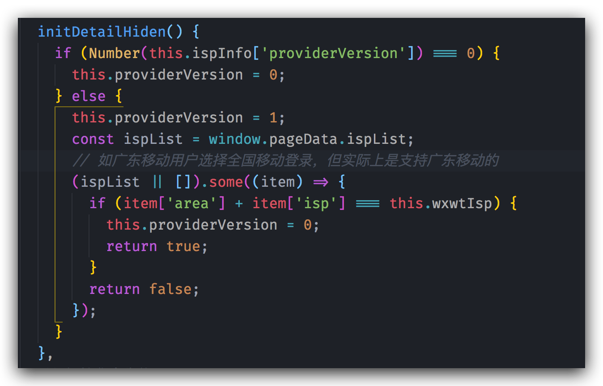
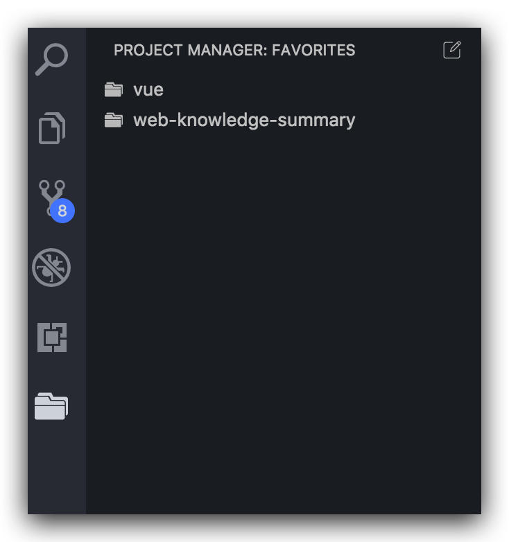
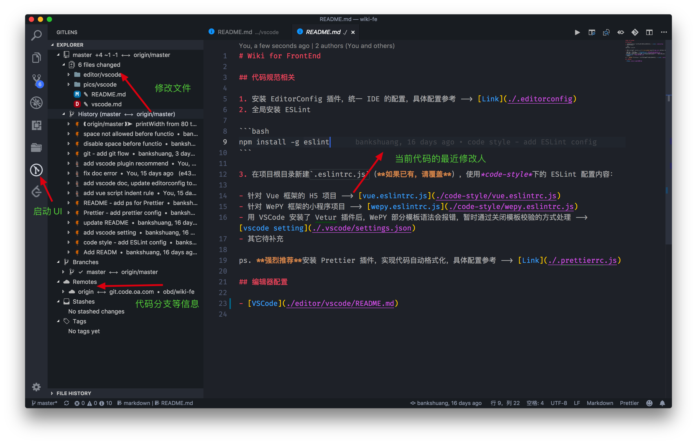
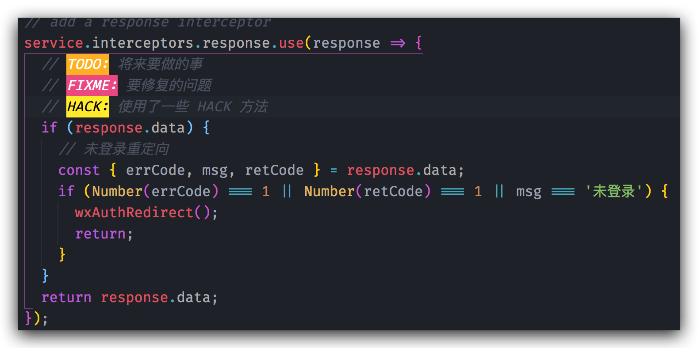

在 VSCode 中直接通过扩展选项搜索安装即可。

## 必备插件

推荐指数：★★★★★

### 语法支持

- [Vetur](https://marketplace.visualstudio.com/items?itemName=octref.vetur)： 提供 Vue 文件的语法高亮，自动补全，格式化等
- [minapp](https://marketplace.visualstudio.com/items?itemName=qiu8310.minapp-vscode)：微信小程序标签、属性的智能补全
- [Beautify css/sass/scss/less](https://marketplace.visualstudio.com/items?itemName=michelemelluso.code-beautifier)： 格式 CSS，Less，Sass 等样式文件

### 风格检查

在提交时做强制检查，从团队的视角保证编码风格的规范性和一致性。

- [ESLint](https://marketplace.visualstudio.com/items?itemName=dbaeumer.vscode-eslint)： 提供 ESLint 检测
- [Prettier](https://marketplace.visualstudio.com/items?itemName=esbenp.prettier-vscode)：代码格式化的工具标准，支持格式化几乎所有的前端代码，并且类似于 EditorConfig 支持用文件来配置格式规则
- [EditorConfig for VSCode](https://marketplace.visualstudio.com/items?itemName=EditorConfig.EditorConfig)：统一编辑器之间的基本配置，通过 .editorconfig 文件进行配置

## 推荐插件

有助于提高工作效率，限制你的不再是你的手，而是你的思想。

### [Auto Close Tag](https://marketplace.visualstudio.com/items?itemName=formulahendry.auto-close-tag)

适用于 `JSX`、`Vue`、`HTML`，在打开标签并且键入 `</` 的时候，能自动补全要闭合的标签

推荐指数：★★★★

### [Auto Rename Tag](https://marketplace.visualstudio.com/items?itemName=formulahendry.auto-rename-tag)

适用于 JSX、Vue、HTML，在修改标签名时，能在你修改开始（结束）标签的时候修改对应的结束（开始）标签，帮你减少 50% 的击键。

推荐指数：★★★★

### [Path Intellisense](https://marketplace.visualstudio.com/items?itemName=christian-kohler.path-intellisense)

文件路径补全，在你用任何方式引入文件系统中的路径时提供智能提示和自动完成。

推荐指数：★★★★★

### [npm Intellisense](https://marketplace.visualstudio.com/items?itemName=christian-kohler.npm-intellisense)

NPM 依赖补全，在你引入任何 node_modules 里面的依赖包时提供智能提示和自动完成。

推荐指数：★★★★★

### 代码片段

代码片段英文叫做 Code Snippets，市面上主流的编辑器也都支持，其基本思想就是把常见的代码模式抽出来，通过 2~3 个键就能展开 N 行代码，代码片段的积累一方面是根据个人习惯，另一方面是学习社区里面积累出来的好的编码模式，如果觉得不适合你，可以改（找个现有的插件依葫芦画瓢），推荐一些代码片断：

- [JavaScript (ES6) code snippets](https://marketplace.visualstudio.com/items?itemName=xabikos.JavaScriptSnippets)

推荐指数：★★★★★

## 功能增强

#### [Bracket Pair Colorizer](https://marketplace.visualstudio.com/items?itemName=CoenraadS.bracket-pair-colorizer)

识别代码中的各种括号，并且标记上不同的颜色，方便你扫视到匹配的括号，在括号使用非常多的情况下能环节眼部压力，编辑器快捷键固然好用，但是在临近嵌套多的情况下却有些力不从心。

推荐指数：★★★★

### [Project Manager](https://marketplace.visualstudio.com/items?itemName=alefragnani.project-manager)

项目管理，让我们方便的在命令面板中切换项目文件夹，当然，你也可以直接打开包含多个项目的父级文件夹，但这样可能会让 VSCode 变慢，支持可视化管理。

推荐指数：★★★★

### [GitLens](https://marketplace.visualstudio.com/items?itemName=eamodio.gitlens)

Git 增强插件，可以查看本地文件修改，历史提交记录，分支，Tags，暂存等信息，基本能满足我们对 Git 的需求，同时也有 Git Blame 作用哦，能够看到文件中代码的最后修改人信息。

推荐指数：★★★★

### [TODO Highlight](https://marketplace.visualstudio.com/items?itemName=wayou.vscode-todo-highlight)

高亮代码中的关键字，支持配置颜色和关键字，帮助你管理计划，再也不怕忘记要修改的内容了。

推荐指数：★★★★

### [Code Runner](https://marketplace.visualstudio.com/items?itemName=formulahendry.code-runner)

名副其实的代码运行插件，支持数十种语言，在不离开代码编辑器的前提下通过命令面板可直接执行代码，并查看输出。

推荐指数：★★★★

### [REST Client](https://marketplace.visualstudio.com/items?itemName=humao.rest-client)

可以直接在 VSCode 中发起 HTTP 请求，并查看返回结果

推荐指数：★★★★

GIF 图片较大，请直接点开链接观看效果。

### [Code Spell Checker](https://marketplace.visualstudio.com/items?itemName=streetsidesoftware.code-spell-checker)

拼写检查插件，从小处做起，杜绝错误的拼写。

推荐指数：★★★★

