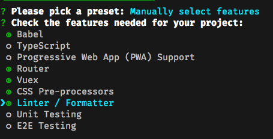
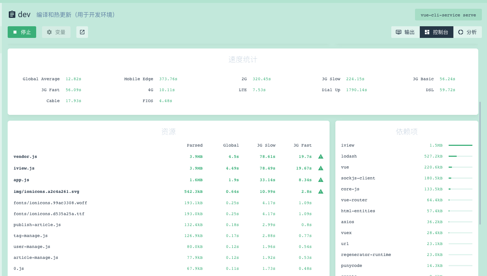
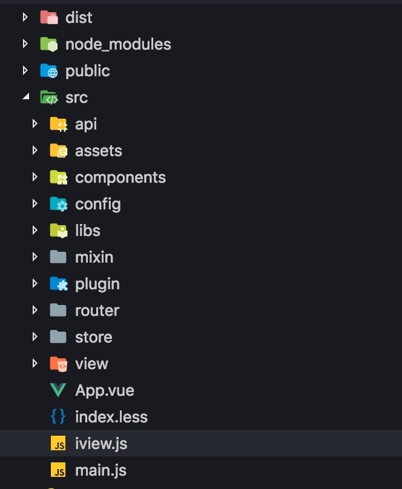

## 脚手架

创建项目的脚手架，大家或多或少都用过，Vue 有 Vue CLI，React 有 Create React APP，这些工具都是方便我们快速创建项目使用的。有些人也许不满足于官方脚手架提供的能力，会自己编写构建代码，比如一些开源的组件库。但是对于一般的项目，我还是建议使用 Vue CLI，简单易上手，也有很强的可扩展性，能满足大多数人的需求。

大多数情况下（不是全部，不要抬杠），我不建议自己去造轮子，去重新写 Webpack 构建代码。因为我自己也造过类似的轮子，深知这里面的坑。不了解 Webpack 的同学，需要投入大量精力去学习怎么配置 Webpack，为了优化项目代码，也要去反复试验，同时也要花功夫应对相关的依赖升级所带来的各种问题。也许，一开始因为好奇心原因，会比较愿意投入较多精力，但终归耐心会被消耗殆尽。

这里不建议自己造轮子，但是相关的知识还是有必要学习的，不然可能 hold 不住项目的诡异需求，同时也为了可以游刃有余的使用 Vue CLI~~

### Vue CLI 初始化

```shell
# 安装
npm install -g @vue/cli

# 创建项目
vue create your-project
```

这里会需要做一些选择，通常需要 `Babel，Router，Vuex，CSS Pre-processors，Linter/Formatter` 等，其他的 Typescript，测试等根据个人项目需要进行选择即可。



后面会让你选择路由模式，这里请谨慎选择 `history` 模式，`history` 模式需要 Web 服务器的支持，否则可能部署到服务器之后无法正常使用。

其余配置根据个人爱好选择即可。

### Vue CLI 配置

这里贴一个我常用的配置作为参考，下面的配置更多是针对页面按需加载（下面会讲）的情况配置的，如果你把所有页面都打包在一个文件里，这份配置可能不适合你

```js
const path = require('path');
const ScriptExtHtmlWebpackPlugin = require('script-ext-html-webpack-plugin');

const resolve = dir => {
    return path.join(__dirname, dir);
};

const isDev = process.env.NODE_ENV === 'development';

module.exports = {
    baseUrl: '/',
    indexPath: 'index.html',
    lintOnSave: true,
    devServer: {
        disableHostCheck: true
    },
    // 组件中的 CSS 较小，暂不分离
    css: {
        extract: false
    },
    configureWebpack: {
        optimization: {
            splitChunks: {
                cacheGroups: {
                    commons: {
                        // 公共模块
                        name: 'common', // chunk name
                        minChunks: 2,
                        minSize: 0,
                        chunks: 'all'
                    },
                    vendor: {
                        // 依赖单独打包
                        test: /[\\/]node_modules[\\/]/,
                        name: 'vendor', // chunk name
                        priority: 10,
                        chunks: 'all'
                    }
                }
            },
            // webpack 管理文件之间关系的模块单独生成一个文件
            runtimeChunk: {
                name: 'manifest'
            }
        }
    },
    chainWebpack: config => {
        config.resolve.alias.set('@', resolve('src')).set('_c', resolve('src/components'));

        // production 下启用插件
        if (!isDev) {
            config.plugin('script-inline').use(
                new ScriptExtHtmlWebpackPlugin({
                    inline: /manifest\..*\.js$/
                })
            );
        }

        // 不预加载 manifest 文件
        config
            .plugin('preload')
            .tap(args => {
                args[0].fileBlacklist.push(/manifest\..*\.js$/);
                return args;
            })
            .end();
    }
};
```

这里一个比较重要的配置是 `runtimeChunk`，这里主要是为了做持久缓存，避免更改单独的页面引起大规模 JS 文件的 Hash 名改变，导致缓存失效的问题。具体的原理，大家可以查阅相关的配置说明，这里就不做深入介绍了。

这里推荐两篇关于 Webpack 的文章，帮助大家理解 Webpack

- [手摸手，带你用合理的姿势使用 Webpack4（上）](https://juejin.im/post/5b56909a518825195f499806)
- [手摸手，带你用合理的姿势使用 Webpack4（下）](https://juejin.im/post/5b5d6d6f6fb9a04fea58aabc#heading-9)

### Vue CLI Tips

这里提几个 Vue CLI 中比较有帮助的一些功能

1. `vue-cli-service build --report`：生成 report.html 以帮助分析包内容，可以借用 report.html 文件分析页面比较大的包，针对性的进行优化。
2. `vue-cli-service build --modern`：[面向现代浏览器进行构建](https://cli.vuejs.org/zh/guide/browser-compatibility.html#%E7%8E%B0%E4%BB%A3%E6%A8%A1%E5%BC%8F)，这里对浏览器兼容性不敏感的应用可以了解一下，有助于减少打包体积。
3. `vue ui`：可以帮助我们分析已用中的包大小
4. [fetch 和 preload](https://cli.vuejs.org/zh/guide/html-and-static-assets.html#preload) 也值得关注，预加载也有助与提升网页表现。



## 项目结构与基本配置

Vue CLI 默认创建的文件结构比较简单，需要加以改造，才能适应大型项目的需求。怎么组织文件结构没有固定的答案，适合自己的才是最好的。

这里我借鉴了开源社区中一些常见的文件结构，加以适当改造



这里主要是按照文件功能进行划分，将不同功能的文件分类

```text
.
├── dist
├── public
└── src
    ├── api // API 接口
    ├── assets // 静态文件
    ├── components // 公共组件
    ├── config
    ├── libs // 工具函数
    ├── mixin // vue mixin
    ├── plugin // vue plugin
    ├── router // 路由
    ├── store // vuex
    └── view // 页面
```

## 组件

### 组件划分

组件是 Vue 最核心的概念之一，这一概念太过宽泛，不同的人理解都会有所不同。这里讲一下我对组件划分的个人看法，我将组件划分成三类

1. **UI 组件/基础组件**：不包含具体业务逻辑，抽象程度较高的组件，常见于我们经常使用的 UI 库中，如 element，iview 中的各种组件。这类组件作为项目的基础控件，会被大量使用，可以通过不同配置实现不同的功能。

2. **页面组件**：构成页面组件，可以是单个页面，也可以是构成页面一部分的组件，这类组件通常用来承载页面结构，获取，处理数据，和业务逻辑结合比较紧密，不会进行复用，因此也不会对外提供接口，常见的就是 `vue-router` 所配置的 `.vue` 组件。

3. **业务组件**：在业务中多次使用的组件，为了提高复用性而抽离的部分，比如封装的 echarts 图表组件等。业务组件可能只在当前项目中用到，不具有很强的通用性，而且可能会包含一些业务相关的逻辑。

每个人的对组件的理解可能有所不同，这里仅供参考。

虽然每个人的理解各有不同，但是很重要的思想就是组件的复用。提高组件的复用性很重要，但是这里我们可能会陷入一个误区：过于追求组件的可复用性，而忽略了和业务逻辑相结合。

举一个例子，在某个页面中，需要展示 3 个相同类型的图表📈，比如折线图，表格数据来源是一样，需要调用**相同的 API**，传入**不同的参数**，响应的数据结构也是基本一致的，一般同学可能会将图表抽离成一个组件，然后在页面中分表获取数据，进行处理，再将处理好后的数据通过 props 传递给图表组件，进行展示。这样做也 OK， 但是我们可以换一种思路，将通过 API 获取数据，处理数据，展示数据的逻辑全部封装在图表组件，通过传入部分参数，控制获取数据的类型以及处理数据的方法。而不是在页面中调用 3 次 API，再处理 3 次数据，避免了重复的代码，进一步提升了复用性。

组件的复用性固然重要，但是也不能一味的追求复用性，而忽略了业务逻辑。

### 组件注册

Vue 允许我们注册全局组件，可以在代码中直接使用，不用在每个页面中通过 import 引入

```js
Vue.component('component-name', Component); // 注册
```

```html
<!-- 使用 -->
<component-name />
```

### 动态组件

某些情况下，我们需要根据不同的条件显示不同的组件，比如在满足一个条件的情况显示组件 A， 否则显示组件 B，我们可能会这样写

```html
<component-a v-if=""></component-a>
<component-b v-else></component-b>
```

当切换的组件较少时，这样也能满足我们的需求，但是当需要切换的组件较多时，这样做就不太优雅，好在 Vue 提供了一个内置组件：[component](https://cn.vuejs.org/v2/api/#component) 可以解决这样的问题

### 组件之间的数据传递

#### [1. Prop](https://cn.vuejs.org/v2/guide/components-props.html)

最常见的方式，也是最简单的方式，适用于父子组件之间进行数据传递。

我们都知道 prop 是单向数据流，子组件不允许直接修改父组件传递的 prop 数据。但是在某些情况下，我们还是会有修改 prop 的需要，比如常见的模态对话框的组件，父组件可以传入 visible 参数控制模态对话框显示，同时模态对话框也能关闭自身。这种情况下，就会涉及到修改传入的 prop 数据。那应该怎么办呢，下面有两种方法可以解决这种情况

**`v-model`**

`v-model` 是 Vue 的内置指令，通常用于进行表单输入双向绑定。`v-model` 仅仅是一个语法糖，相当于 `:value="xxx"` 和 `@input="val=>xxx=val"`

```html
<Modal v-model="visible" />
<Modal :value="" @input="value => visible = value">
```

组件内部可以通过触发 `input` 事件修改 `v-model` 绑定的数据

```js
// Modal 组件内
this.$emit('input', data);
```

**[`.sync` 修饰符](https://cn.vuejs.org/v2/guide/components-custom-events.html#sync-%E4%BF%AE%E9%A5%B0%E7%AC%A6)**

`.sync` 修饰符可以说是官方为需要 prop 双向绑定提供的一种解决方案，是和 `v-model` 类似的语法糖

```html
<text-document v-bind:title.sync="title"></text-document>
<!-- 相当于 -->
<text-document
  v-bind:title="doc.title"
  v-on:update:title="doc.title = $event">
</text-document>
```

```js
this.$emit('update:title', newTitle)
```

#### 2. vuex

这种方法也比较容易想到，一个组件将数据存到 vuex 中，另一个组件再通过 vuex 获取数据，这种方法通常使用非父子组件之间传递数据，但是相对比较麻烦。

#### 3. 发布/订阅模式

得益于 Vue 组件内部实现的 `$emit` 和 `$on` 方法，我们可以非常方便的使用发布/订阅模式，我们只需要在 Vue 根组件上挂载一个新的 Vue 实例就可以使用发布/订阅模式

```js
// main.js
Vue.prototype.$bus = new Vue();

// 组件一
this.$bus.$emit('event', data);

// 组件二
this.$bus.$on('event', data => {});
```

通过发布/订阅模式，我们可以在任意组件之间传递数据，这种方法通常适用于不同层级的组件之间进行数据传递。

- [Vue 组件通信之 Bus](https://juejin.im/post/5a4353766fb9a044fb080927)

#### 4. [provide/inject](https://cn.vuejs.org/v2/api/#provide-inject)

`provide/inject` 是 Vue 2.2.0 版本后新增的 API，允许一个祖先组件向其所有子孙后代注入一个依赖，**不论组件层次有多深**，并在起上下游关系成立的时间里始终生效，如果你熟悉 React 的话，就会感觉这与 React 的上下文特性很相似。provide 选项应该是一个对象或返回一个对象的函数，该对象包含可注入其子孙的属性。

一个例子

```js
// 父级组件提供 'foo'
var Provider = {
    provide: {
        foo: 'bar'
    }
};

// 子组件注入 'foo'
var Child = {
    inject: ['foo'],
    created() {
        console.log(this.foo); // => "bar"
    }
};
```

需要注意的是：

> provide 和 inject 绑定并不是可响应的，这是刻意为之的。然而，如果你传入了一个可监听的对象，那么其对象的属性还是可响应的。

官方建议：provide 和 inject 主要为高阶插件/组件库提供用例，并不推荐直接用于应用程序代码中。但是我们任然可以将其应用到我们的代码中，在组件之间传递数据。

如果我们在根组件中使用 provide，在其他任何组件中都可以使用 inject 获取数据，provide/inject 也能代替 vuex，进行全局的状态管理。

#### 5. vue-router

我们在使用路由跳转的时候，可以携带一定的数据，这种方法适用于在会发生路由转换的组件之间进行数据传递

使用 query

```js
// 浏览器导航栏 /register?plan=private
router.push({ path: 'register', query: { plan: 'private' } });

// 目标组件
console.log(this.$route.query); // { plan: 'private' }

```

使用 params

```js
const router = new VueRouter({
  routes: [
    { path: '/user/:id', component: User }
  ]
});

router.push({ name: 'user', params: { userId } }) // -> /user/123
// 目标组件
console.log(this.$route.params); // { userId }
```

值得注意的是当我们设置一个路由对象的 `porps` 选项为 `true` 时，`route.params` 将会作为组件的 `props` 数据传递给组件

```js
const router = new VueRouter({
  routes: [
    {
      path: '/user',
      props: true,
      components: User
    }
  ]
})

router.push({ name: 'user', params: { userId } });

const User = {
  props: ['id'],
  template: '<div>User {{ id }}</div>'
}
```

这里提到了三种通过路由传递数据的方式，通过 query 和 params 传递数据时，数据都会在 url 中体现出来，适合传递 String，Number 等简单的数据，而通过 porps 则不会显示，适合传递一些数组，对象等复杂的数据。

### 组件访问

通过 `ref` 可以获得子组件的引用，同时访问组件的属性和方法

```js
<input ref="input">

methods: {
  // 用来从父级组件聚焦输入框
  focus: function () {
    this.$refs.input.focus()
  }
}
```

同理，可以通过 `$parent` 和 `$root` 可以获得父组件和根组件的引用，进而访问属性和方法。

```js
// 调用根组件的方法
this.$root.method();

this.$parent.method();
```

## 请求与接口

在网页中，我们会通过发送 HTTP 请求获取我们需要的数据，优雅，高效的处理 HTTP 请求是很重要。在 Vue 中，通常会使用 [axios](https://github.com/axios/axios) 处理 HTTP 请求。

在使用 axios 时，我们要考虑灵活性，错误处理，接口管理等，经过个人的实践与参考开源项目，找到了一种比较好的实践方法，个人可以根据项目需要进行更改，同时也可以发挥创造力，增加其他的配置

### 封装 HttpRequest 类

创建 `libs/axios.js` 文件

```js
import axios from 'axios';
import router from '@/router';
import { errorReport } from '@/plugin/error-report'; // 错误上报，下面会讲
import { getCookie, removeCookies } from '@/libs/util';

// 消息提示
const errorMessage = msg => {
    Message.error({
        content: msg,
        duration: 3
    });
};

class HttpRequest {
    constructor(baseUrl) {
        this.baseUrl = baseUrl;
        this.requestQueue = [];
        this.maxPathLength = 50;
    }

    // 默认配置
    getInsideConfig() {
        const config = {
            baseURL: this.baseUrl,
            headers: {
            },
            timeout: 30000
        };
        return config;
    }

    // 记录用户发送的请求路径信息
    recodeRequestPath(config) {
        const time = Date.now();
        const path = `${time}: ${config.method} => ${config.url}`;
        while (this.requestQueue.length >= this.maxPathLength) {
            this.requestQueue.shift();
        }
        this.requestQueue.push(path);
    }

    // 处理响应错误，记录错误信息，进行上报
    handleError(error) {
        if (error.response) {
            const { status, statusText, config, data } = error.response;
            errorReport(error, {
                status,
                statusText,
                url: config.url,
                method: config.method,
                responseData: data,
                requestQueue: this.requestQueue
            });
        } else if (error.request) {
            const { response, status, statusText, responseURL } = error.request;
            errorReport(error, {
                status,
                statusText,
                response,
                url: responseURL,
                requestQueue: this.requestQueue
            });
        } else {
            errorReport(error, {
                status,
                requestQueue: this.requestQueue
            });
        }
    }

    // 拦截
    interceptors(instance, url) {
        // 请求拦截
        instance.interceptors.request.use(
            config => {
                // 记录用户请求路径，在错误上报后，便于进行错误复现
                this.recodeRequestPath(config);
                return config;
            },
            error => {
                this.handleError(error);
                return Promise.reject(error);
            }
        );

        // 响应拦截
        instance.interceptors.response.use(
            res => {
                // 解构数据
                const { data } = res;
                return data;
            },
            error => {
                if (error.message.indexOf('Network Error') > -1) {
                    Message.error({
                        content: '网络异常，请检查你的网络！',
                        duration: 3
                    });
                }
                // 服务器响应
                if (error.response) {
                    const { status } = error.response;
                    if (!status) {
                        return Promise.reject(error);
                    }
                    switch (status) {
                        case 400:
                            errorMessage('请求参数异常！');
                            break;
                        case 401:
                            errorMessage('身份信息已过期，请重新登录！');
                            removeCookies(['token']); // 清除身份信息
                            // 路由重定向
                            setTimeout(() => {
                                router.push({ name: 'login' });
                            }, 500);
                            break;
                        // 其他情况处理
                        default:
                            errorMessage('服务异常');
                    }
                    return Promise.reject(error);
                }
                this.handleError(error);
            }
        );
    }

    request(options) {
        const instance = axios.create();
        options = Object.assign(this.getInsideConfig(), options);
        this.interceptors(instance, options.url);
        return instance(options);
    }
}

export default HttpRequest;
```

### 创建 HttpRequest 实例

可以创建一个 `http.js` 文件，用于创建 axios 实例，根据环境配置 baseURL 等信息，同时也方便在多个 API 接口文件之间复用

```js
import HttpRequest from '@/libs/axios';
import config from '@/config';
const baseUrl = process.env.NODE_ENV === 'production' ? config.baseUrl.idc : config.baseUrl.dev;

const axios = new HttpRequest(baseUrl);

export axios;
```

### 接口管理

当我们的项目有很多接口时，对接口进行模块划分会使得接口管理更加方便

```js
// api/user.js
import axios from '@/libs/api.request';

export const login = ({ username, password }) => {
    return axios.request({
        url: 'login',
        method: 'POST',
        data: {
            username,
            password
        }
    });
};
```

Vue 组件中可以方便的调用封装的登陆方法

```js
import login from '@/api/user';

// 调用登陆接口
login().then(res => {}).catch(err => {});
```

## 路由

### [按需加载](https://router.vuejs.org/zh/guide/advanced/lazy-loading.html)

按需加载可以减少单个包的体积，增加首页的加载速度

```js
{
    path: '/',
    name: 'home',
    component: () => import('@/view/home.vue')
}
```

### 钩子函数

#### 加载进度条

通过 vue-router 的钩子函数，可以方便的实现加载进度条功能

```js
// 具体的 UI 实现可以使用 UI 组件，或者使用单独的库 - NProcess
router.beforeEach((to, from, next) => {
    LoadingBar.start();
    next();
});

router.afterEach(to => {
    setTitle(to, router.app);
    LoadingBar.finish();
});
```
   
#### 权限控制

### 保存滚动位置

### watch $router

### 钩子函数

## 状态管理

### 减少依赖

### 模块化

## 错误处理

### 格式化错误信息

### 错误上报

## 代码与技巧

### 内置方法 map，forEach

- [Vue 项目里戳中你痛点的问题及解决办法（更新）](https://juejin.im/post/5b174de8f265da6e410e0b4e#heading-26)
- [Vue 组件通信精髓归纳](https://segmentfault.com/a/1190000018241972)
- [「从源码中学习」Vue 源码中的 JS 骚操作](https://juejin.im/post/5c73554cf265da2de33f2a32)
