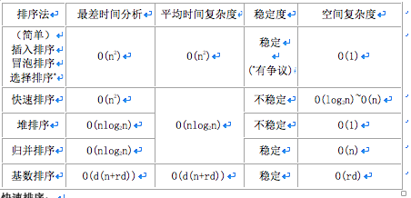

# 数据结构与算法

## 什么是哈希表

哈希表也叫散列表，是一种根据关键字直接访问存储位置的数据结构。也就是说，它通过计算一个关于键值的函数，将所需查询的数据映射到表中一个位置来访问记录，这加快了查找速度。这个映射函数称做散列函数，存放记录的数组称做散列表。

## 栈和堆的区别

栈区（stack）—由编译器自动分配释放，存放函数的参数值，局部变量的值等。
堆区（heap）—一般由程序员分配释放，若程序员不释放，程序结束时可能由OS回收。
堆（数据结构）：堆可以被看成是一棵树，如：堆排序。
栈（数据结构）：一种先进后出的数据结构。

## 常用排序算法及其时空复杂度

### 快速排序

1. 从数列中挑出一个元素，称为“基准”（pivot）；
2. 重新排序数列，所有元素比基准值小的摆放在基准前面，所有元素比基准值大的摆在基准的后面（相同的数可以到任一边）。在这个分区退出之后，该基准就处于数列的中间位置。这个称为分区（partition）操作。
3. 递归地（recursive）把小于基准值元素的子数列和大于基准值元素的子数列排序。

### 堆排序

* 堆排序是利用堆这种数据结构所设计的一种排序算法。堆积是一个近似完全二叉树的结构，并且子结点的键值或索引总是小于（或者大于）它的父节点。
* 利用大顶堆(小顶堆)堆顶记录的是最大关键字(最小关键字)这一特性，使得每次从无序中选择最大记录(最小记录)变得简单。
* 将待排序的序列构造成一个最大堆，此时序列的最大值为根节点；依次将根节点与待排序序列的最后一个元素交换，再维护从根节点到该元素的前一个节点为最大堆，如此往复，最终得到一个递增序列。

### 希尔排序

希尔排序：先将整个待排序列（增量）分成若干个子序列分别进行直接插入排序，待整个序列中的记录“基本有序”时，再对全体记录进行一次直接插入排序。

### 线性阶(O(n))排序

基数排序、计数排序、桶排序（哈希排序、散列排序）。