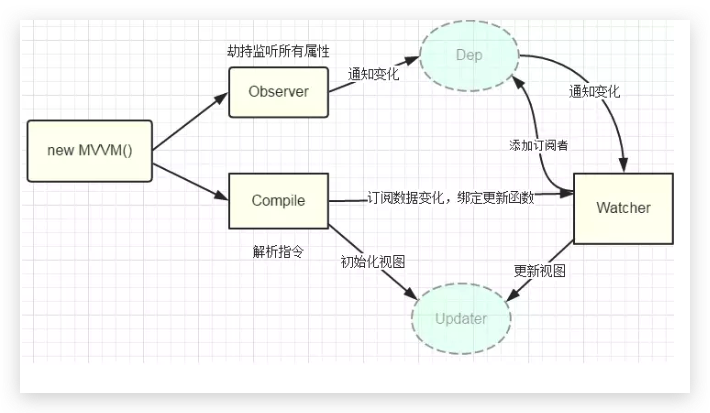

# Vue

## 模版的渲染过程

1. new Vue()，执行初始化
2. 挂载$mount 方法，通过自定义 render、template、el 等生成 Render 函数
3. compile 函数主要是：parse()将 template 映射为 AST（抽象语法树），optimize()优化 AST，generate()再将 AST 转换为 Render 函数
4. 通过 Watcher 监听数据的变化，当数据发生变化时，Render 函数执行生成 VNode 对象
5. update()判断是否首次渲染，是则直接创建真实 DOM，否则调用 patch()
6. patch.js 对比新旧 VNode 对象，通过 DOM Diff 算法，优化真实 DOM 操作

## 生命周期


- [如何解释 vue 的生命周期才能令面试官满意？](https://juejin.im/post/5ad10800f265da23826e681e)

## 双向绑定

利用 `Object.defineProperty` 劫持对象属性的访问器，在属性值发生变化时可以获取变化，从而进行进一步操作。

如果只有一个数据，一处地方使用，那么我们可以通过 `Object.defineProperty` 直接修改数据变化的行为方式，这显然是不可能，我们的数据往往有多个，数据使用的地方也可能有多处，这就是一个多对多的关系。在这种情况下，我们就要抽象出一种模型，来帮助我们快速，有效地完成对象属性的访问器劫持，以及在属性变化时快速的完成更新。

目前，我们有一些数据源，有一些地方需要响应数据的变化，我们可以得知数据的变化，这是一个典型的订阅-发布模型可以解决的问题。对一个数据的变化，我们可以创建一个集散中心，收集响应数据变化的地方，当数据发生变化时，进行通知，触发更新。这是基本的思想，下面可以建立详细的模型。

首先，对单个数据，也就是对象的单个属性，建立模型：

1. 有一个订阅-发布模型的中心，定义为 Dep，可以收集响应数据变化的地方，在数据变化时通知依赖更新。
2. 我们需要有一个 Observe，可以劫持对象的属性，在属性发生改变时，通知 Dep 中心，让 Dep 中心通知订阅者进行更新。
3. 为了更方便的处理响应数据变化的地方，我们可以定义一个订阅者 Watcher 模型，封装向 Dep 中添加订阅的方法，以及数据变化时更新自身的方法。
4. 最后，怎么得知哪里需要响应数据的变化，也就是需要创建那些订阅者 Watcher，我们需要一个 Compiler 去编译我们的模板，获取需要创建订阅者的地方。

下面就是这个模型的示意图：



当然，这种双向绑定还存在一定问题，`Object.defineProperty` 无法监听数组变化。但是可能有些人有些疑问，Vue 中是可以监听数组变化的啊，那是因为作者使用了一些 Hack 方法解决了这个问题：

```js
const aryMethods = ['push', 'pop', 'shift', 'unshift', 'splice', 'sort', 'reverse'];
const arrayAugmentations = [];

aryMethods.forEach((method)=> {

    // 这里是原生Array的原型方法
    let original = Array.prototype[method];

   // 将 push, pop 等封装好的方法定义在对象 arrayAugmentations 的属性上
   // 注意：是属性而非原型属性
    arrayAugmentations[method] = function () {
        console.log('我被改变啦!');

        // 调用对应的原生方法并返回结果
        return original.apply(this, arguments);
    };

});

let list = ['a', 'b', 'c'];
// 将我们要监听的数组的原型指针指向上面定义的空数组对象
// 别忘了这个空数组的属性上定义了我们封装好的 push 等方法
list.__proto__ = arrayAugmentations;
list.push('d');  // 我被改变啦！ 4

// 这里的 list2 没有被重新定义原型指针，所以就正常输出
let list2 = ['a', 'b', 'c'];
list2.push('d');  // 4
```

### 参考

- [vue 的双向绑定原理及实现](https://juejin.im/entry/5923973da22b9d005893805a)
- [剖析 Vue 实现原理 - 如何实现双向绑定 mvvm](https://github.com/DMQ/mvvm)
- [面试官: 实现双向绑定 Proxy 比 defineproperty 优劣如何?](https://juejin.im/post/5acd0c8a6fb9a028da7cdfaf#heading-12)

## 虚拟 DOM（Virtual DOM）

Vue 2.0 引入了 VDOM， Vue 作者尤雨溪的文章：

> Vue 2.0 引入 vdom 的主要原因是 vdom 把渲染过程抽象化了，从而使得组件的抽象能力也得到提升，并且可以适配 DOM 以外的渲染目标。

当然，由于 VDOM 会将 DOM 的变化优化到比较小的程度，考虑到 VDOM 的更新速度和 DOM 的更新速度之间的差异，在某些场景下，VDOM 可能会提升渲染速度。

### 虚拟 DOM diff 算法

基本思想：

- Web UI 中 DOM 节点跨层级的移动操作特别少，可以忽略不计。
- 拥有相同类的两个组件将会生成相似的树形结构，拥有不同类的两个组件将会生成不同的树形结构。
- 对于同一层级的一组子节点，它们可以通过唯一 id 进行区分。

- [Vue 的理念问题](https://zhuanlan.zhihu.com/p/23752826)

## Vue 的路由实现

- [从 vue-router 看前端路由的两种实现](https://zhuanlan.zhihu.com/p/27588422)
- [vue-router源码分析-整体流程](https://github.com/DDFE/DDFE-blog/issues/9)

### 相关文章

- [Vue.js 技术揭秘](https://ustbhuangyi.github.io/vue-analysis/)
- [Vue 技术内幕](http://hcysun.me/vue-design/)