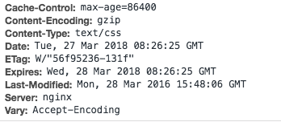

# HTTP 协议

## 常见的 HTTP Header

### 内容编码

| 协议头           | 说明                                           | 示例                                   | 状态 |
| ---------------- | ---------------------------------------------- | -------------------------------------- | ---- |
| Accept           | 可接受的响应内容类型（`Content-Types`）        | `Accept: text/plain`                   | 固定 |
| Accept-Charset   | 可接受的字符集                                 | `Accept-Charset: utf-8`                | 固定 |
| Accept-Encoding  | 可接受的响应内容的编码方式                     | `Accept-Encoding: gzip, deflate`       | 固定 |
| Accept-Language  | 可接受的响应内容语言列表                       | `Accept-Language: en-US`               | 固定 |
| Content-Encoding | 响应资源所使用的编码类型。                     | `Content-Encoding: gzip`               | 固定 |
| Content-Language | 响就内容所使用的语言                           | `Content-Language: zh-cn`              | 固定 |
| Content-Length   | 响应消息体的长度，用8进制字节表示              | `Content-Length: 348`                  | 固定 |
| Content-Location | 所返回的数据的一个候选位置                     | `Content-Location: /index.htm`         | 固定 |
| Content-Range    | 如果是响应部分消息，表示属于完整消息的哪个部分 | Content-Range: bytes 21010-47021/47022 | 固定 |
| Content-Type     | 当前内容的`MIME`类型                           | Content-Type: text/html; charset=utf-8 | 固定 |

### 跨域

| 响应头                           | 说明                             | 示例                         |
| -------------------------------- | -------------------------------- | ---------------------------- |
| Access-Control-Allow-Origin      | 指定哪些网站可以`跨域源资源共享` | *                            |
| Access-Control-Allow-Credentials | 指定跨域允许使用 cookie          | true                         |
| Access-Control-Allow-Methods     | 指定跨域允许使用的方法           | GET, PUT, POST, DELETE, HEAD |

### 缓存

| 协议头              | 说明                                                                                                                                                                  | 示例                                               | 状态       |
| ------------------- | --------------------------------------------------------------------------------------------------------------------------------------------------------------------- | -------------------------------------------------- | ---------- |
| Cache-Control       | 用来指定当前的请求/回复中的，是否使用缓存机制。                                                                                                                       | `Cache-Control: no-cache`                          | 固定       |
| Connection          | 客户端（浏览器）想要优先使用的连接类型                                                                                                                                | `Connection: keep-alive`                           | 固定       |
| Cookie              | 由之前服务器通过`Set-Cookie`设置的Cookie                                                                                                                              | `Cookie: $Version=1; Skin=new;`                    | 固定：标准 |
| If-Match            | 仅当客户端提供的实体与服务器上对应的实体相匹配时，才进行对应的操作。主要用于像 PUT 这样的方法中，仅当从用户上次更新某个资源后，该资源未被修改的情况下，才更新该资源。 | If-Match: "9jd00cdj34pss9ejqiw39d82f20d0ikd"       | 固定       |
| If-Modified-Since   | 允许在对应的资源未被修改的情况下返回304未修改                                                                                                                         | If-Modified-Since: Dec, 26 Dec 2015 17:30:00 GMT   | 固定       |
| If-None-Match       | 允许在对应的内容未被修改的情况下返回304未修改（ 304 Not Modified ），参考 超文本传输协议 的实体标记                                                                   | If-None-Match: "9jd00cdj34pss9ejqiw39d82f20d0ikd"  | 固定       |
| If-Range            | 如果该实体未被修改过，则向返回所缺少的那一个或多个部分。否则，返回整个新的实体                                                                                        | If-Range: "9jd00cdj34pss9ejqiw39d82f20d0ikd"       | 固定       |
| If-Unmodified-Since | 仅当该实体自某个特定时间以来未被修改的情况下，才发送回应。                                                                                                            | If-Unmodified-Since: Dec, 26 Dec 2015 17:30:00 GMT | 固定       |
| ETag                | 对于某个资源的某个特定版本的一个标识符，通常是一个 消息散列                                                                                                           | ETag: "737060cd8c284d8af7ad3082f209582d"           | 固定       |
| Expires             | 指定一个日期/时间，超过该时间则认为此回应已经过期                                                                                                                     | Expires: Thu, 01 Dec 1994 16:00:00 GMT             | 固定: 标准 |
| Last-Modified       | 所请求的对象的最后修改日期(按照 RFC 7231 中定义的“超文本传输协议日期”格式来表示)                                                                                    | Last-Modified: Dec, 26 Dec 2015 17:30:00 GMT       | 固定       |

- [HTTP消息头（HTTP headers）－常用的HTTP请求头与响应头](https://itbilu.com/other/relate/EJ3fKUwUx.html)

## HTTP 状态码

- `100 Continue` 继续，一般在发送 post 请求时，已发送了 http header 之后服务端将返回此信息，表示确认，之后发送具体参数信息
- `200 OK` 正常返回信息
- `201 Created` 请求成功并且服务器创建了新的资源
- `202 Accepted` 服务器已接受请求，但尚未处理

- `301 Moved Permanently` 请求的网页已永久移动到新位置。
- `302 Found` 临时性重定向。
- `303 See Other` 临时性重定向，且总是使用 GET 请求新的 URI。
- `304 Not Modified` 自从上次请求后，请求的网页未修改过。

- `400 Bad Request` 服务器无法理解请求的格式，客户端不应当尝试再次使用相同的内容发起请求。
- `401 Unauthorized` 请求未授权。
- `403 Forbidden` 禁止访问。
- `404 Not Found` 找不到如何与 URI 相匹配的资源。

- `500 Internal Server Error` 最常见的服务器端错误。
- `502 Bad Gateway Web` 服务器用作网关或代理服务器时收到了无效响应。
- `503 Service Unavailable` 服务器端暂时无法处理请求（可能是过载或维护）。

## HTTP 重定向 301/302/303/307

301 状态码在 HTTP 1.0 和 HTTP 1.1 规范中均代表 `永久重定向`，在请求的 URL 被移除时使用，同时要在响应的 Location 首部中指明资源现在所处的 URL。

在 HTTP 1.0 规范中，302 表示临时重定向，客户端在后续的请求中应该继续使用原地址。原请求是 POST，则不应该自动进行重定向，必须跟用户确认是否该重发。原请求是 GET，可以自动重定向。但是在实际情况中，浏览器和服务器的实现并没有严格遵守 HTTP 中 302 的规范，很多浏览器会把 POST 请求变成 GET 请求。

在 HTTP 1.1 中，实际上 302 是不再推荐使用的，只是为了兼容而作保留。规范中再次重申只有当原请求是 GET 或者 HEAD 方式的时候才能自动的重定向，为了消除 HTTP 1.0 中 302 的二义性，在 HTTP 1.1 中引入了 303 和 307 来细化 HTTP 1.0 中 302 的语义。

把 HTTP 1.0 规范中 302 的规范和实现拆分开，分别赋予 HTTP 1.1 中 303 和 307，因此在 HTTP 1.1 中，303 继承了 HTTP 1.0 中 302 的实现，即原请求是 POST，也允许自动进行重定向，结果是无论原请求是 GET 还是 POST，都可以自动进行重定向，而 307 则继承了 HTTP 1.0 中 302 的规范，即如果原请求是 POST，则不允许进行自动重定向，结果是 POST 不重定向，GET 可以自动重定向。

### 参考

- [HTTP 重定向 301/302/303/307](https://blog.csdn.net/reliveit/article/details/50776984###;)
- [HTTP 状态码 302、303 和 307 的故事](https://www.cnblogs.com/cswuyg/p/3871976.html)

## GET 和 POST

- GET 一般用于信息获取，POST 一般用于修改服务器上的资源。
- GET 是通过地址栏来传值，而 POST 是通过提交表单来传值。
- GET 在浏览器回退时是无害的，而 POST 会再次提交请求。
- GET 请求会被浏览器主动 cache，而 POST 不会，除非手动设置。
- GET 请求参数可被完整保留在浏览器历史记录、书签里，而 POST 中的参数不会被保留。
- GET 请求在 URL 中传送的参数是有长度限制的（一般在 2000 个字符），而 POST 一般木有。
- GET 请求只能进行 url 编码，而 POST 支持多种编码方式。
- 对参数的数据类型，GET 只接受 ASCII 字符，而 POST 没有限制。
- GET 比 POST 更不安全，因为参数直接暴露在 URL 上，所以不能用来传递敏感信息。
- GET 方式的请求，浏览器会把 http header 和 data 一并发送出去，服务器响应 200（返回数据）；
- 而对于 POST，浏览器先发送 header，服务器响应 100 continue，浏览器再发送 data，服务器响应 200 ok（返回数据）。

### 建议阅读

- [HTTP 中 GET 与 POST 的区别 99% 的错误认识](https://segmentfault.com/a/1190000010872233)

## 缓存

浏览器缓存分为 `强缓存` 和 `协商缓存`。当客户端请求某个资源时，获取缓存的流程如下：

* 先根据这个资源的一些 http header 判断它是否命中强缓存，如果命中，则直接从本地获取缓存资源，不会发请求到服务器。
* 当强缓存没有命中时，客户端会发送请求到服务器，服务器通过另一些 request header 验证这个资源是否命中协商缓存，称为 http 再验证，如果命中，服务器将请求返回，但不返回资源，而是告诉客户端直接从缓存中获取，客户端收到返回后就会从缓存中获取资源。
* 当协商缓存也没命中时，服务器就会将资源发送回客户端。
* 当 ctrl+f5 强制刷新网页时，直接从服务器加载，跳过强缓存和协商缓存。
* 当 f5 刷新网页时，跳过强缓存，但是会检查协商缓存。

强缓存和协商缓存共同之处在于，如果命中缓存，服务器都不会返回资源。区别是，强缓存不对发送请求到服务器，但协商缓存会。

### 强缓存

强缓存是利用 `Expires` 或者 `Cache-Control` 这两个 http header 实现的，它们都用来表示资源在客户端缓存的有效期。

#### Expires

Expires 是 http1.0 提出的一个表示资源过期时间的 header，它描述的是一个绝对时间，由服务器返回，用 GMT 格式的字符串表示，如：Expires:Thu, 31 Dec 2037 23:55:55 GMT。

它的缓存原理是：

1. 浏览器第一次跟服务器请求一个资源，服务器在返回这个资源的同时，在 response 的 header 加上 Expires 的 header。

2. 浏览器在接收到这个资源后，会把这个资源连同所有 response header 一起缓存下来（所以缓存命中的请求返回的 header 并不是来自服务器，而是来自之前缓存的 header）。

3. 浏览器再请求这个资源时，先从缓存中寻找，找到这个资源后，拿出它的 Expires 跟当前的请求时间比较，如果请求时间在 Expires 指定的时间之前，就能命中缓存，否则就不行。

4. 如果缓存没有命中，浏览器直接从服务器加载资源时，Expires Header 在重新加载的时候会被更新。

Expires 是较老的强缓存管理 header，由于它是服务器返回的一个绝对时间，在服务器时间与客户端时间相差较大时，缓存管理容易出现问题，比如随意修改下客户端时间，就能影响缓存命中的结果。

#### Cache-Control

在 http1.1 的时候，提出了一个新的 header，就是 Cache-Control，这是一个相对时间，在配置缓存的时候，`以秒为单位`，用数值表示，如：Cache-Control:max-age=315360000。

它的缓存原理是：

1. 浏览器第一次跟服务器请求一个资源，服务器在返回这个资源的同时，在 response 的 header 加上 Cache-Control 的 header，如：

2. 浏览器在接收到这个资源后，会把这个资源连同所有 response header 一起缓存下来；

3. 浏览器再请求这个资源时，先从缓存中寻找，找到这个资源后，根据它第一次的请求时间和 Cache-Control 设定的有效期，计算出一个资源过期时间，再拿这个过期时间跟当前的请求时间比较，如果请求时间在过期时间之前，就能命中缓存，否则就不行。

4. 如果缓存没有命中，浏览器直接从服务器加载资源时，Cache-Control Header 在重新加载的时候会被更新。

Cache-Control 描述的是一个相对时间，在进行缓存命中的时候，都是利用客户端时间进行判断，所以相比较 Expires，Cache-Control 的缓存管理更有效，安全一些。

这两个 header 可以只启用一个，也可以同时启用，当 response header 中，Expires 和 Cache-Control 同时存在时，Cache-Control 优先级高于 Expires。

### 协商缓存

当浏览器对某个资源的请求没有命中强缓存，就会发一个请求到服务器，验证协商缓存是否命中，如果协商缓存命中，请求响应返回的 http 状态为 304 并且会显示一个 Not Modified 的字符串。

协商缓存是利用的是【Last-Modified，If-Modified-Since】和【ETag、If-None-Match】这两对 Header 来管理的。

#### Last-Modified 和 If-Modified-Since

1. 浏览器第一次跟服务器请求一个资源，服务器在返回这个资源的同时，在 response 的 header 加上 Last-Modified 的 header，这个 header 表示这个资源在服务器上的最后修改时间。

2. 浏览器再次跟服务器请求这个资源时，在 request 的 header 上加上 If-Modified-Since 的 header，这个 header 的值就是上一次请求时返回的 Last-Modified 的值。

3. 服务器再次收到资源请求时，根据浏览器传过来 If-Modified-Since 和资源在服务器上的最后修改时间判断资源是否有变化，如果没有变化则返回 304 Not Modified，但是不会返回资源内容；如果有变化，就正常返回资源内容。当服务器返回 304 Not Modified 的响应时，response header 中不会再添加 Last-Modified 的 header，因为既然资源没有变化，那么 Last-Modified 也就不会改变，这是服务器返回 304 时的 response header。

4. 浏览器收到 304 的响应后，就会从缓存中加载资源。

5. 如果协商缓存没有命中，浏览器直接从服务器加载资源时，Last-Modified Header 在重新加载的时候会被更新，下次请求时，If-Modified-Since 会启用上次返回的 Last-Modified 值。

【Last-Modified，If-Modified-Since】都是根据服务器时间返回的 header，一般来说，在没有调整服务器时间和篡改客户端缓存的情况下，这两个 header 配合起来管理协商缓存是非常可靠的，但是有时候也会服务器上资源其实有变化，但是最后修改时间却没有变化的情况，而这种问题又很不容易被定位出来，而当这种情况出现的时候，就会影响协商缓存的可靠性。

#### ETag 和 If-None-Match

1. 浏览器第一次跟服务器请求一个资源，服务器在返回这个资源的同时，在 response 的 header 加上 ETag 的 header，这个 header 是服务器根据当前请求的资源生成的一个唯一标识，这个唯一标识是一个字符串，只要资源有变化这个串就不同，跟最后修改时间没有关系，所以能很好的补充 Last-Modified 的问题。

2. 浏览器再次跟服务器请求这个资源时，在 request 的 header 上加上 If-None-Match 的 header，这个 header 的值就是上一次请求时返回的 ETag 的值。

3. 服务器再次收到资源请求时，根据浏览器传过来 If-None-Match 和然后再根据资源生成一个新的 ETag，如果这两个值相同就说明资源没有变化，否则就是有变化。如果没有变化则返回 304 Not Modified，但是不会返回资源内容。如果有变化，就正常返回资源内容。与 Last-Modified 不一样的是，当服务器返回 304 Not Modified 的响应时，由于 ETag 重新生成过，response header 中还会把这个 ETag 返回，即使这个 ETag 跟之前的没有变化。

4. 浏览器收到 304 的响应后，就会从缓存中加载资源。如果协商缓存没有命中，浏览器直接从服务器加载资源，同时返回新的 ETag。

### 缓存管理

* 通过代码的方式，在 web 服务器返回的响应中添加 Expires，Last-Modified，ETag 等。
* 通过配置 web 服务器的方式，让 web 服务器在响应资源的时候统一添加 Expires，Last-Modified，ETag 等。
* 给资源加上一个动态的参数，如 `css/index.css?v=0abcdf32`，让 url 的修改与文件内容关联，也就是说，只有文件内容变化，才会导致相应 url 的变更，从而实现文件级别的精确缓存控制。什么东西与文件内容相关呢？我们会很自然的联想到利用 [数据摘要要算法](https://www.jianshu.com/p/05ef46c1a47f) 对文件求摘要信息，摘要信息与文件内容一一对应，就有了一种可以精确到单个文件粒度的缓存控制依据了。

### 缓存的好处

缓存的好处是显而易见的， 好处有：

* 减少了冗余的数据传输，节省了网费。

* 减少了服务器的负担， 大大提高了网站的性能。

* 加快了客户端加载网页的速度。

- [HTTP缓存控制小结](http://imweb.io/topic/5795dcb6fb312541492eda8c)

## HTTP 和 HTTPS

HTTPS 和 HTTP 的区别主要如下：

1. HTTPS 协议需要到 CA 申请证书，一般免费证书较少，因而需要一定费用。
2. HTTP 是超文本传输协议，信息是明文传输，HTTPS 则是具有安全性的 SSL 加密传输协议。
3. HTTP 和 HTTPS 使用的是完全不同的连接方式，用的端口也不一样，前者是80，后者是443。
4. HTTP 的连接很简单，是无状态的.HTTPS 协议是由 SSL + HTTP 协议构建的可进行加密传输、身份认证的网络协议，比 HTTP 协议安全。

### SSL/TLS 加密过程

#### 客户端发出请求（ClientHello）

首先，客户端（通常是浏览器）先向服务器发出加密通信的请求，这被叫做 ClientHello 请求。在这一步，客户端主要向服务器提供以下信息。

- 支持的协议版本，比如TLS 1.0版。
- 一个客户端生成的随机数，稍后用于生成"对话密钥"。
- 支持的加密方法，比如RSA公钥加密。
- 支持的压缩方法。

#### 服务器回应（SeverHello）

服务器收到客户端请求后，向客户端发出回应，这叫做 SeverHello 。服务器的回应包含以下内容：

- 确认使用的加密通信协议版本，比如TLS 1.0版本。如果浏览器与服务器支持的版本不一致，服务器关闭加密通信。
- 一个服务器生成的随机数，稍后用于生成"对话密钥"。
- 确认使用的加密方法，比如RSA公钥加密。
- 服务器证书。

#### 客户端回应

客户端收到服务器回应以后，首先验证服务器证书。如果证书不是可信机构颁布、或者证书中的域名与实际域名不一致、或者证书已经过期，就会向访问者显示一个警告，由其选择是否还要继续通信。

如果证书没有问题，客户端就会从证书中取出服务器的公钥。然后，向服务器发送下面三项信息：

- 一个随机数。该随机数用服务器公钥加密，防止被窃听。
- 编码改变通知，表示随后的信息都将用双方商定的加密方法和密钥发送。
- 客户端握手结束通知，表示客户端的握手阶段已经结束。这一项同时也是前面发送的所有内容的 `hash` 值，用来供服务器校验。

上面第一项的随机数，是整个握手阶段出现的第三个随机数，又称 `pre-master key`。有了它以后，客户端和服务器就同时有了三个随机数，接着双方就用事先商定的加密方法，各自生成本次会话所用的同一把"会话密钥"。

#### 服务器的最后回应

服务器收到客户端的第三个随机数 `pre-master key` 之后，计算生成本次会话所用的"会话密钥"。然后，向客户端最后发送下面信息：

- 编码改变通知，表示随后的信息都将用双方商定的加密方法和密钥发送。
- 服务器握手结束通知，表示服务器的握手阶段已经结束。这一项同时也是前面发送的所有内容的hash值，用来供客户端校验。

至此，整个握手阶段全部结束。接下来，客户端与服务器进入加密通信，就完全是使用普通的HTTP协议，只不过用"会话密钥"加密内容。

- [SSL/TLS协议运行机制的概述](http://www.ruanyifeng.com/blog/2014/02/ssl_tls.html)
- [图解SSL/TLS协议](http://www.ruanyifeng.com/blog/2014/09/illustration-ssl.html)

## HTTP/1.1

### 长连接（keep-alive）

默认情况下，HTTP 连接在请求完成后会被关闭，即服务器在发送响应信息之后会关闭 TCP 连接。当网页要请求许多资源时，就要频繁的建立，而建立一个连接，则需要进行三次握手 (HTTPS 的话则是 9 次握手)，这极大的浪费了性能。

因此 HTTP/1.1 新增了 `keep-alive` 功能，keep-alive 允许多个 HTTP 会话使用同一个 TCP 连接，避免了建立多个 TCP 连接的性能消耗，加快了资源的传输速度。

#### 启动 keep-alive

- Web 服务器启动 keep-alive 功能
- HTTP Header 中加入 `Connection: keep-alive`
- 设置 keep-alive 的超时时间和最大请求数目： `Keep-Alive: timeout=10, max=20`

### PipeLining 管道

持久连接解决了连接复用问题，但还是存在着一个问题：在一个 TCP 连接中，同一时间只能够发送一个请求，并且需要等响应完成才能够发送第二个请求。

因此 HTTP/1.1 制订了 PipeLining 管道，通过这个管道，浏览器的多个请求可以同时发到服务器，但是服务器的响应只能够一个接着一个的返回 (但各大浏览器有些不支持 / 默认关闭, 因此这功能可以说是鸡肋)

### 连接和拼接

连接或拼接 JS 和 CSS 文件，雪碧图，以减少 HTTP 请求，同时浏览器可缓存这些静态资源，为下次访问节约时间。但是这样带来的副作用是，维护成本高，其中某一个小改动都会使得整个拼接后的文件发生改变，重新缓存。

### 参考

- [What is Keep-Alive?](https://blog.stackpath.com/glossary/keep-alive/)

## HTTP/2.0

HTTP/2 可以让我们的应用更快、更简单、更稳定。HTTP/2 的目的是通过支持完整的请求与响应复用来减少延迟，通过有效压缩 HTTP 标头字段将协议开销降至最低，同时增加对请求优先级和服务器推送的支持。

HTTP/2 所有性能增强的核心在于新的二进制分帧层，它定义了如何封装 HTTP 消息并在客户端与服务器之间传输。HTTP/2 将请求和响应数据分割为更小的帧，并且它们采用二进制编码。

基本概念：

- 数据流：已建立的连接内的双向字节流，可以承载一条或多条消息。
- 消息：与逻辑请求或响应消息对应的完整的一系列帧。
- 帧：HTTP/2 通信的最小单位，每个帧都包含帧头，至少也会标识出当前帧所属的数据流。

交互关系：

- 所有通信都在一个 TCP 连接上完成，此连接可以承载任意数量的双向数据流。
- 每个数据流都有一个唯一的标识符和可选的优先级信息，用于承载双向消息。
- 每条消息都是一条逻辑 HTTP 消息（例如请求或响应），包含一个或多个帧。
- 帧是最小的通信单位，承载着特定类型的数据，例如 HTTP 标头、消息负载，等等。来自不同数据流的帧可以交错发送，然后再根据每个帧头的数据流标识符重新组装。

### 多路复用

多路复用允许同时通过单一的 HTTP/2 连接发起多重的请求-响应消息。

在 HTTP/1.1 协议中 「浏览器客户端在同一时间，针对同一域名下的请求有一定数量限制，超过限制数目的请求会被阻塞」。HTTP/2 中新的二进制分帧层突破了这些限制，实现了完整的请求和响应复用：客户端和服务器可以将 HTTP 消息分解为互不依赖的帧，然后交错发送，最后再在另一端把它们重新组装起来。

### 请求优先级

既然所有资源都是并行发送，那么就需要「优先级」的概念了，这样就可以对重要的文件进行先传输，加速页面的渲染。

### 服务器推送

HTTP/2 新增的另一个强大的新功能是，服务器可以对一个客户端请求发送多个响应。 换句话说，除了对最初请求的响应外，服务器还可以向客户端推送额外资源，而无需客户端明确地请求。如果一个请求是由你的主页发起的，服务器很可能响应主页内容、logo 以及样式表，因为它知道客户端会用到这些东西。这相当于在一个 HTML 文档内集合了所有的资源，不过与之相比，服务器推送有一个很大的优势：可以缓存！

### 首部压缩（Header Compression）

每个 HTTP 传输都承载一组标头，这些标头说明了传输的资源及其属性。HTTP 1.x 的 Header 由于 cookie 和 user agent 很容易造成比较大的开销，而且每次都要重复发送。为了减少此开销和提升性能，HTTP/2 使用 HPACK 压缩格式压缩请求和响应标头元数据，这种格式采用两种简单但是强大的技术：

- 这种格式支持通过静态 Huffman 代码对传输的标头字段进行编码，从而减小了各个传输的大小。
- 这种格式要求客户端和服务器同时维护和更新一个包含之前见过的标头字段的索引列表（换句话说，它可以建立一个共享的压缩上下文），此列表随后会用作参考，对之前传输的值进行有效编码。

简单来说，第一，通过 Huffman 算法对 Header 进行压缩，第二，通过维护一个索引列表，将变化减到最小，只传输发生变化的数据。

### 强制 SSL

虽然 HTTP/2.0 协议并没声明一定要用 SSL，但是 Google Chrome 等浏览器强制要求使用 HTTP/2.0 必须要用上 SSL（https）。

### 参考

- [HTTP/2 简介](https://developers.google.com/web/fundamentals/performance/http2/?hl=zh-cn#_2)
- [HTTP/2.0 简单总结](https://linjunzhu.github.io/blog/2016/03/10/http2-zongjie/)
- [HTTP/2.0 相比 1.0 有哪些重大改进？](https://www.zhihu.com/question/34074946)
- [从输入 URL 到展现涉及哪些缓存环节(非常详细)](https://mp.weixin.qq.com/s/tuQ66vnipDcg_rYABfP2kA)