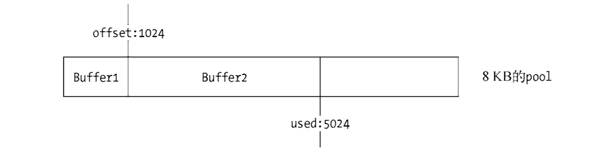

# Buffer（缓冲区）

## Buffer 是什么？

Buffer 是一个类 Array 的对象，是物理内存存储的一个区域，用于临时存储数据，可以用于 TCP 流，文件系统操作等处理大量二进制数据的场景。[WIKI](https://www.wikiwand.com/en/Data_buffer)

Buffer 对象类似于存储整数的数组，但是它的大小在创建后就是固定的。Buffer 中的元素为 16 进制的两位数，即 0 到 255 的数值。给元素的赋值如果小于 0，就将该值逐次加 256，直到得到一个 0 到 255 之间的整数。如果得到 的数值大于 255，就逐次减 256，直到得到 0~255 区间内的数值。如果是小数，舍弃小数部分，只保留整数部分。 
```js
// Creates a zero-filled Buffer of length 10.
const buf1 = Buffer.alloc(10);
console.log(buf1); // <Buffer 00 00 00 00 00 00 00 00 00 00>

// Creates a Buffer of length 10, filled with 0x1.
const buf2 = Buffer.alloc(10, 1);
console.log(buf2); // <Buffer 01 01 01 01 01 01 01 01 01 01>

const buf3 = Buffer.alloc(10, 1.2);
console.log(buf3); // <Buffer 01 01 01 01 01 01 01 01 01 01>
```

> **注意：`new Buffer()` 语法已废弃**

Buffer 对象的内存分配不是在 V8 的堆内存中，而是在 Node 的 C++ 层面实现内存的申请的。因为处理大量的字节数据不能采用需要一点内存就向操作系统申请一点内存的方式，这可能造成大量的内存申请的系统调用，对操作系统有一定压力。为此 Node 在内存的使用上应用的是在 C++ 层面申请内存、在 JavaScript 中分配内存的策略。

## Buffer 内存分配

为了高效地使用申请来的内存，Node 采用了 [slab 分配机制](https://www.wikiwand.com/en/Slab_allocation)。

简单而言，slab 就是一块申请好的固定大小的内存区域。slab 具有如下 3 种状态

- full：完全分配状态。 
- partial：部分分配状态。
- empty：没有被分配状态。

Node 以 8 KB 为界限来区分 Buffer 是大对象还是小对象。如果指定 Buffer 的大小少于 8 KB，Node 会按照小对象的方式进行分配，反之则按照大对象进行分配。

Buffer 的分配过程中主要使用一个局部变量 pool 作为中间处理对象，处于分配状态的 slab 单元都指向它。

```js
Buffer.poolSize = 8 * 1024;
var pool;

function allocPool() {
  pool = new SlowBuffer(Buffer.poolSize);
  pool.used = 0;
}
```

### 小对象

当分配小对象时，会去检查 pool 对象，如果 pool 没有被创建，将会创建一个新的 slab 单元指向它

```js
if (!pool || pool.length - pool.used < this.length) allocPool();
```

同时当前 Buffer 对象的 parent 属性指向该 slab，并记录下是从这个 slab 的哪个位置（offset）开始使用的，slab 对象自身也记录被使用了多少字节

```js
this.parent = pool;
this.offset = pool.used;
pool.used += this.length;
```

当再次创建一个 Buffer 对象时，构造过程中将会判断这个 slab 的剩余空间是否足够。如果足够，使用剩余空间，并更新 slab 的分配状态。如果 slab 剩余的空间不够，将会构造新的 slab，原 slab 中剩余的空间会造成浪费。



此外，Buffer 分配空间时还做了一些特殊处理

```js
function alignPool() {
  // Ensure aligned slices
  if (poolOffset & 0x7) {
   poolOffset |= 0x7;
   poolOffset++;
  }
}
```

这里做了8字节的内存对齐处理。

- 如果不按照平台要求对数据存放进行对齐，会带来存取效率上的损失。比如32位的Intel处理器通过总线访问(包括读和写)内存数据。每个总线周期从偶地址开始访问32位内存数据，内存数据以字节为单位存放。如果一个32位的数据没有存放在4字节整除的内存地址处，那么处理器就需要2个总线周期对其进行访问，显然访问效率下降很多。

- Node.js 是一个跨平台的语言，第三方的 C++ addon 也是非常多，避免破坏了第三方模块的使用，比如 directIO 就必须要内存对齐。

> 详细：https://github.com/nodejs/node/pull/2487


### 大对象

如果需要超过 8 KB 的 Buffer 对象，将会直接分配一个 SlowBuffer 对象作为 slab 单元，这个 slab 单元将会被这个大 Buffer 对象独占。

## 字符串编码

当使用 Buffer 操作字符串时，要注意编码问题，Node 支持的编码类型是比较有限的：

- ascii
- utf8
- utf16le
- ucs2： utf16le 的别名
- base64
- latin1
- binary： latin1 的别名
- hex

在中国常用的 GBK、GB2312 和 BIG-5 编码都不在支持的行列中。对于不支持的编码类型，可以借助 Node 生态圈中的模块完成转换。[iconv](https://www.npmjs.com/package/iconv) 和 [iconv-lite](https://www.npmjs.com/package/iconv-lite) 两个模块可以支持更多的编码类型转换，其中 iconv-lite 采用纯 JavaScript 实现，iconv 则通过 C++ 调用 libiconv 库完成。前者比后者更轻量， 无须编译和处理环境依赖直接使用。

## Buffer 拼接

Buffer 在使用场景中，通常是以一段一段的方式传输。以下是常见的从输入流中读取内容的

```js
var fs = require('fs');
var rs = fs.createReadStream('test.md');
var data = '';
rs.on('data', function(chunk) {
    data += chunk;
});
rs.on('end', function() {
    console.log(data);
});
```

上面这段代码常见于国外，用于流读取的示范，data 事件中获取的 chunk 对象即是 Buffer 对象。对于初学者而言，容易将 Buffer 当做字符串来理解，所以在接受上面的示例时不会觉得有任何异常。一旦输入流中有宽字节编码时，问题就会暴露出来。`data += chunk;` 等价于 `data = data.toString() + chunk.toString();`，`toString()` 方法默认以 UTF-8 为编码，中文字在 UTF-8 下占3个字节，当处理流时，Buffer 的长度很可能不是 3 的倍数，就会出现截断问题，转换成字符串就会出现乱码。

正确的拼接方式是用一个数组来存储接收到的所有Buffer片段并记录下所有片段的总长度， 然后调用 Buffer.concat() 方法生成一个合并的 Buffer 对象。

```js
const buf1 = Buffer.alloc(10);
const buf2 = Buffer.alloc(14);
const buf3 = Buffer.alloc(18);
const totalLength = buf1.length + buf2.length + buf3.length;

console.log(totalLength); // 42

const bufA = Buffer.concat([buf1, buf2, buf3], totalLength);

console.log(bufA); // <Buffer 00 00 00 00 ...>
console.log(bufA.length); // 42
```


### 相关文章

- [C/C++拾遗之内存对齐(Memory Alignment)](http://notes.maxwi.com/2016/07/21/cpp-gleaning-memory-allignment/)