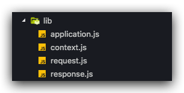

# Koa

入口文件：lib/application.js
Node 版本要求：^4.8.4 || ^6.10.1 || ^7.10.1 || >= 8.1.4
版本：2.5.3

使用

```js
const Koa = require('koa');
const app = new Koa();

app.use(ctx => {
  ctx.body = 'Hello Koa';
});

app.listen(3000);
```

主要文件



## application.js

### 模块导出

```js
module.exports = class Application extends Emitter {
  constructor() {}
  listen(...args) {}
  toJSON() {}
  inspect() {}
  use() {}
  callback() {}
  handleRequest(ctx, fnMiddelware) {}
  createContext(req, res) {}
  onerror(err) {}
};
```

### constructor

```js
constructor() {
  super();
  this.proxy = false;
  // 存储 middleware
  this.middleware = [];
  this.subdomainOffset = 2;
  this.env = process.env.NODE_ENV || 'development';
  // 导入 context，request，response
  this.context = Object.create(context);
  this.request = Object.create(request);
  this.response = Object.create(response);
  if (util.inspect.custom) {
    this[util.inspect.custom] = this.inspect;
  }
}
```

### use

Koa 中的比较常用的就是中间件，Koa 支持 3 种不同种类的中间件：普通函数，async 函数，generator 函数

```js
// 普通函数
app.use((ctx, next) => {})
// async 函数
app.use(async (ctx, next) => {})
// generator 函数
app.use(*(ctx, next) => {})
```

我们来看看 use 方法

```js
// 使用中间件函数，转换老的风格
use(fn) {
  // 检验传递的参数是否为函数，否则抛出错误
  if (typeof fn !== 'function') throw new TypeError('middleware must be a function!');
  // 引用 is-generator-function 库，判断函数是否为 generator 函数
  if (isGeneratorFunction(fn)) {
    // 提示信息
    deprecate('Support for generators will be removed in v3. ' +
              'See the documentation for examples of how to convert old middleware ' +
              'https://github.com/koajs/koa/blob/master/docs/migration.md');
    // 将基于 generator 的旧的中间件转换为 promise 中间件
    fn = convert(fn);
  }
  debug('use %s', fn._name || fn.name || '-');
  // 添加到中间件数组中
  this.middleware.push(fn);
  return this;
}
```

`listen` 的功能很简单 ，就是使用 http 模块创建服务

```js
listen(...args) {
  debug('listen');
  // createServer 接受一个 options 对象或一个处理请求的方法
  // app 启动时，this.callback 就会被调用，返回一个处理请求的方法
  // 当请求到来时，处理请求的方法才会被调用
  const server = http.createServer(this.callback());
  // 启动服务器，监听端口
  return server.listen(...args);
}
```

我们可以看到 listen 中使用到了 `this.callback` 方法，那我们看看 `this.callback` 做了什么

```js
callback() {
  // 处理 middleware 数组，返回一个启动函数
  const fn = compose(this.middleware);
  // listenerCount 是 EventEmitter 的一个方法，返回监听某个事件的监听函数的数目
  // 这里的意思是：如果没有监听处理错误的方法，则添加一个默认的处理错误的方法
  if (!this.listenerCount('error')) this.on('error', this.onerror);
  // 声明处理请求的方法
  // 启动后不会立刻调用，只有接收请求时才会调用
  const handleRequest = (req, res) => {
    // 创建上下文 ctx
    const ctx = this.createContext(req, res);
    // 处理请求
    return this.handleRequest(ctx, fn);
  };
  // 返回处理请求的方法
  return handleRequest;
}
```

这个比较重要的就是对 `this.middleware` 的处理，我们需要看看 compose 对 middleware 数组的的处理

```js
// 接收一个 middleware 数组
function compose(middleware) {
  // 校验参数
  if (!Array.isArray(middleware)) throw new TypeError('Middleware stack must be an array!');
  for (const fn of middleware) {
    if (typeof fn !== 'function') throw new TypeError('Middleware must be composed of functions!');
  }

  // 返回一个函数，函数接收 ctx 与 next
  return function(context, next) {
    // last called middleware #
    let index = -1;
    return dispatch(0);
    function dispatch(i) {
      // 不允许多次调用 next
      // 多次调用 next 会导致 index = i，可以通过 index 是否等于 i 判断是否存在多次调用
      if (i <= index) return Promise.reject(new Error('next() called multiple times'));
      index = i;
      // 获取 middleware 函数
      let fn = middleware[i];
      // 当顺序执行完所有数组后，fn 被复制 next，从后面代码中可以得知 next 为 undefined
      // 然后触发 Promise.resolve() 结束执行
      if (i === middleware.length) fn = next;
      // middleware 数组为空时，直接返回
      if (!fn) return Promise.resolve();
      // 执行 middleware，使用 try...catch 捕获错误
      try {
        // 使用 Promise.resolve 包装 middleware 运行结果
        // fn 传入 ctx 和 next，next 为 dispatch 包装的下一个 middleware
        return Promise.resolve(fn(context, dispatch.bind(null, i + 1)));
      } catch (err) {
        return Promise.reject(err);
      }
    }
  };
}
```

### 创建上下文 ctx

```js
createContext(req, res) {
  const context = Object.create(this.context);
  const request = context.request = Object.create(this.request);
  const response = context.response = Object.create(this.response);
  context.app = request.app = response.app = this;
  context.req = request.req = response.req = req;
  context.res = request.res = response.res = res;
  request.ctx = response.ctx = context;
  request.response = response;
  response.request = request;
  context.originalUrl = request.originalUrl = req.url;
  context.state = {};
  return context;
}
```

#### ctx 属性委托

通过 [node-delegates](https://github.com/tj/node-delegates) 进行属性委托，实现 ctx.body 到 ctx.response.body 的访问，简化了使用。

```js
delegate(proto, 'response')
  .method('attachment')
  .method('redirect')
  .method('remove')
  .method('vary')
  .method('set')
  .method('append')
  .method('flushHeaders')
  .access('status')
  .access('message')
  .access('body')
  ...

delegate(proto, 'request')
  .method('acceptsLanguages')
  .method('acceptsEncodings')
  .method('acceptsCharsets')
  .method('accepts')
  .method('get')
  .method('is')
  .access('querystring')
  .access('idempotent')
  .access('socket')
  .access('search')
  .access('method')
  ...
```

### 其他

```js
// 处理请求
handleRequest(ctx, fnMiddleware) {
  const res = ctx.res;
  res.statusCode = 404;
  const onerror = err => ctx.onerror(err);
  // middleware 执行完成后处理响应结果
  const handleResponse = () => respond(ctx);
  // 当 HTTP 请求关闭时执行回调处理错误
  onFinished(res, onerror);
  return fnMiddleware(ctx).then(handleResponse).catch(onerror);
}
```
