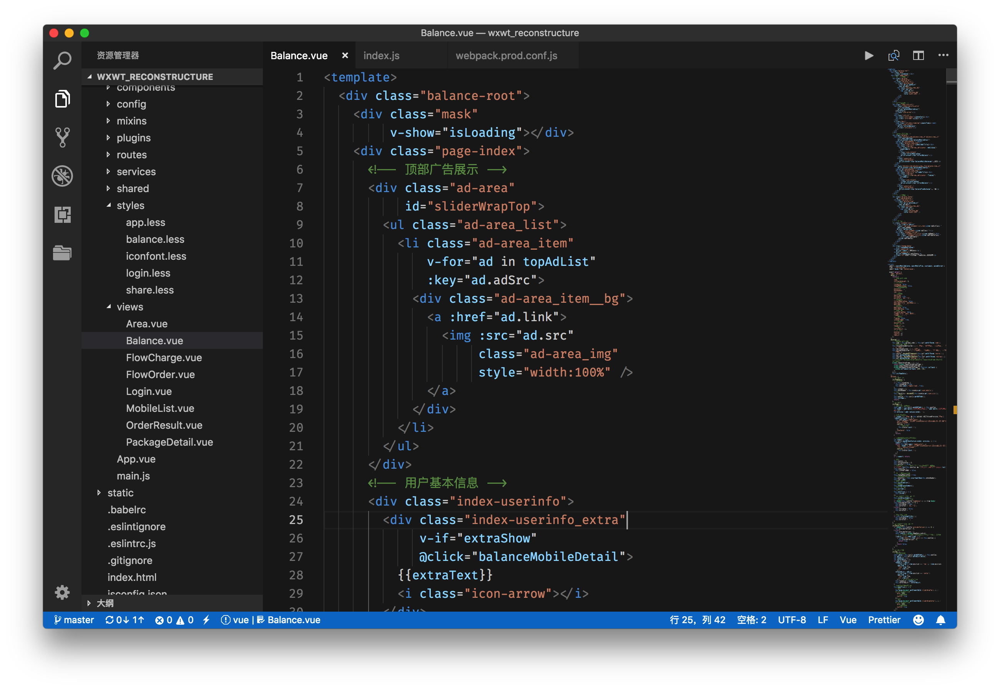
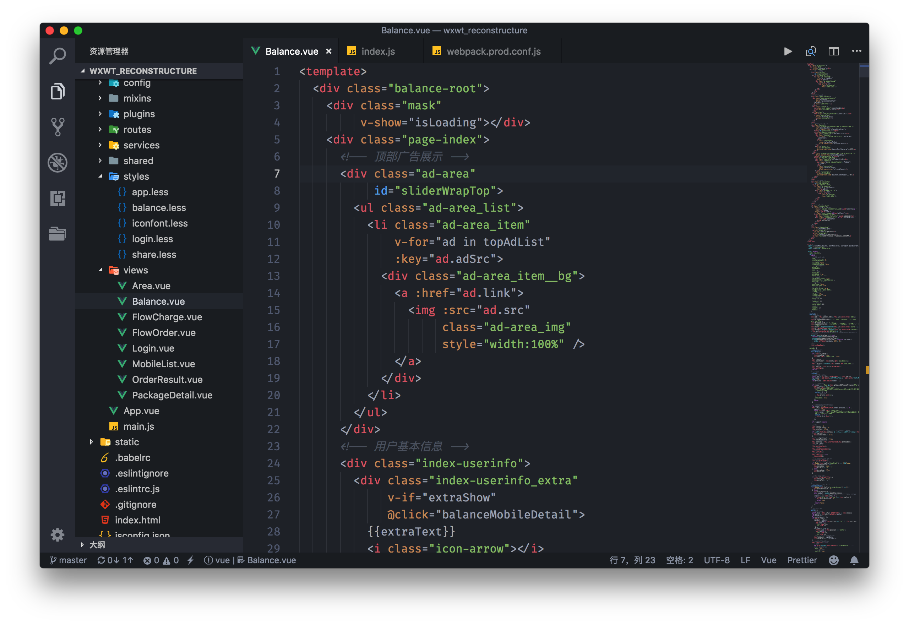
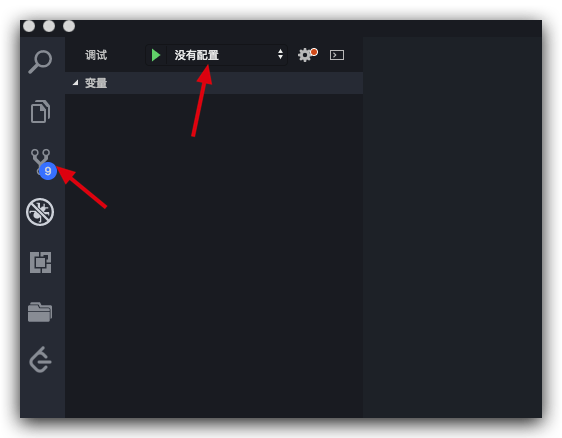
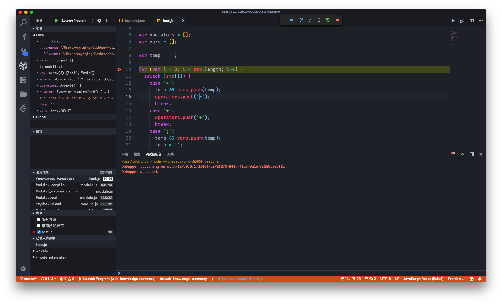
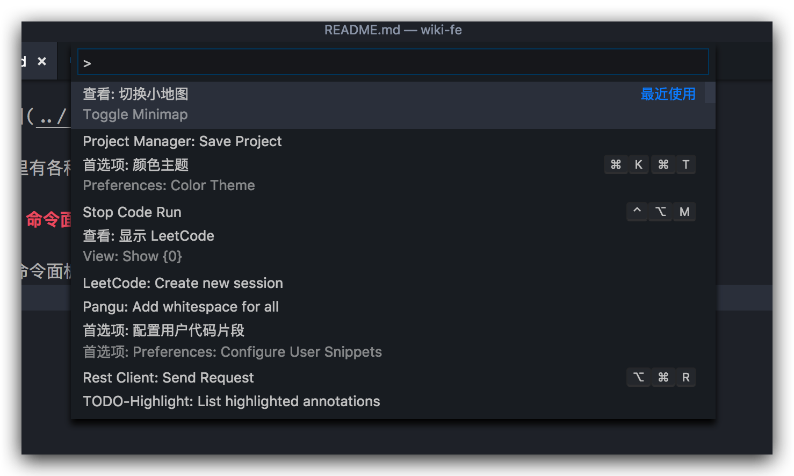
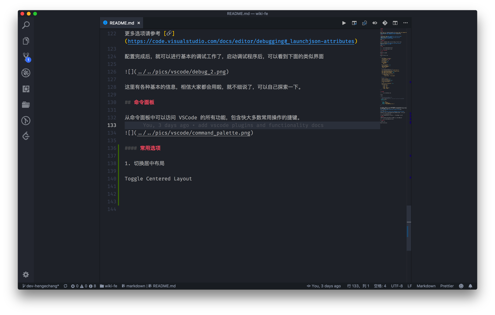
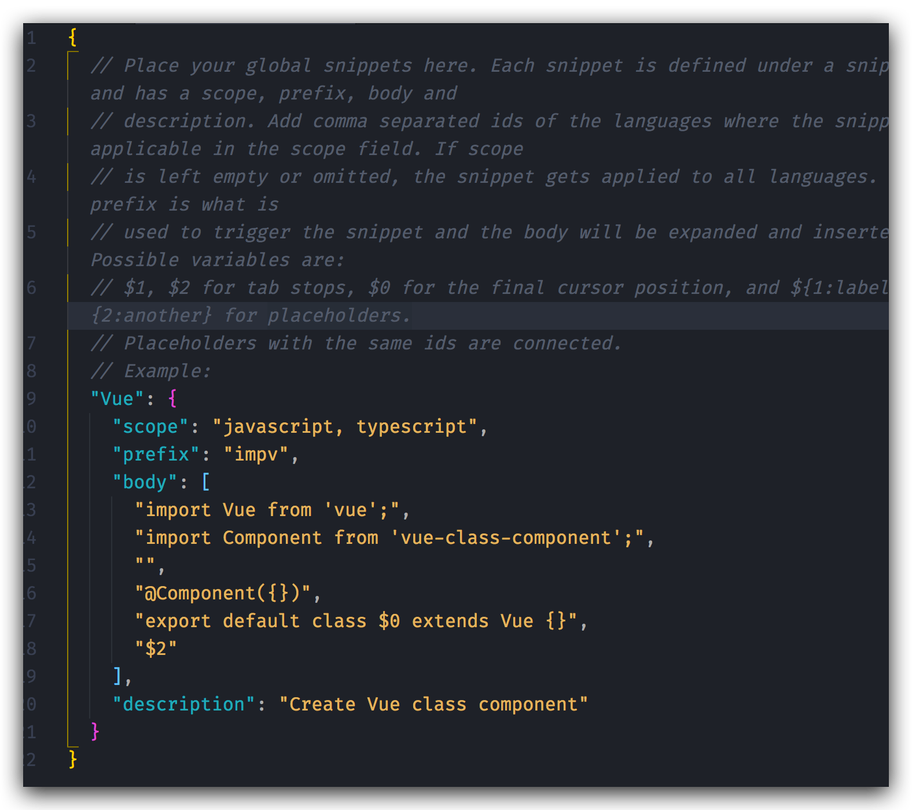
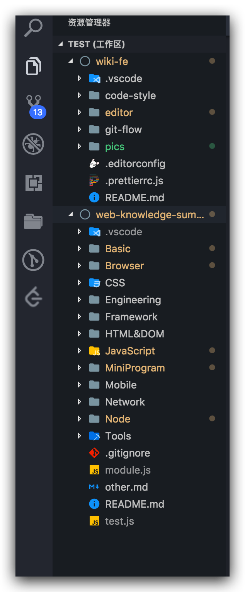
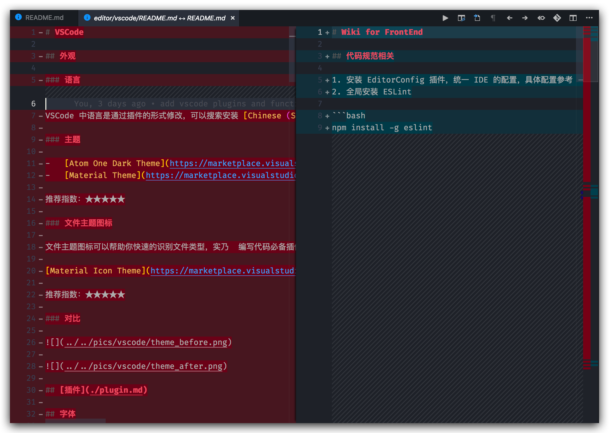
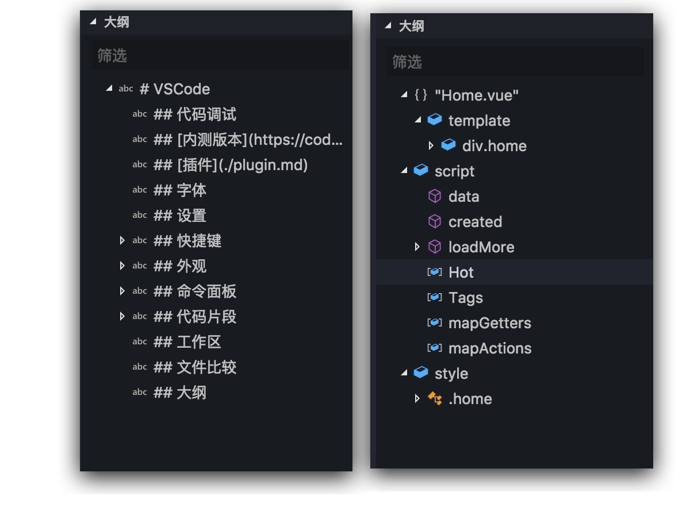

# VSCode

## [内测版本](https://code.visualstudio.com/insiders/)

和很多软件一样，VSCode 也有内测版本，内测版本可以体验最新的功能，喜欢尝鲜的同学可以体验，不过也不能忽略内测版本会有不稳定的情况。

## 外观

### 语言

VSCode 中语言是通过插件的形式修改，可以搜索安装 [Chinese (Simplified) Language Pack for Visual Studio Code](https://marketplace.visualstudio.com/items?itemName=MS-CEINTL.vscode-language-pack-zh-hans) 修改语言为中文。

### 主题

- [Atom One Dark Theme](https://marketplace.visualstudio.com/items?itemName=akamud.vscode-theme-onedark)
- [Material Theme](https://marketplace.visualstudio.com/items?itemName=Equinusocio.vsc-material-theme)

推荐指数：★★★★★

### 文件主题图标

文件主题图标可以帮助你快速的识别文件类型，实乃  编写代码必备插件。

[Material Icon Theme](https://marketplace.visualstudio.com/items?itemName=PKief.material-icon-theme)

推荐指数：★★★★★

### 对比





## [插件](./plugin.md)

VSCode 提供了通过[命令行安装插件](https://code.visualstudio.com/docs/editor/extension-gallery#_command-line-extension-management)的方法，我们可以在终端中执行 `code --install-extension extensionId` 来安装我们想要安装的插件。基于这种可能，为了简化安装插件的过程，WIKI 中提供了批量安装插件的脚本，你可以通过提供的 `extension.sh` 脚本直接安装文档内涉及的，建议安装的插件。当然，你可以修改脚本，注释掉相关插件的安装代码来选择想要安装的插件以及主题。

**注意：**，通过命令行安装插件需要保证命令行可以访问网络，必要时需要设置终端代理。

## 字体

推荐字体：Fira Code。

## 设置

VSCode 用户配置/项目配置

```js
{
    // 自动保存
    "files.autoSave": "afterDelay",
    "files.autoSaveDelay": 500,
    // 折叠换行
    "editor.wordWrap": "on",
    // 开启 ESLint 检测
    "eslint.enable": true,
    "eslint.validate": [
        "javascript",
        "vue"
    ],
    "eslint.autoFixOnSave": true,
    // Emmet 支持语言
    "emmet.includeLanguages": {
      "vue-html": "html",
      "wxml": "html"
    },
    // vetur 配置
    // 使用 VSCode 自带程序格式化 JS 文件
    "vetur.format.defaultFormatter.js": "vscode-typescript",
    // 使用 js-beautify-html 格式 HTML 模板
    "vetur.format.defaultFormatter.html": "js-beautify-html",
    "vetur.format.scriptInitialIndent": true,
    "vetur.format.styleInitialIndent": true,
    // 格式 HTML 模板
    "vetur.format.defaultFormatterOptions": {
        "js-beautify-html": {
            // tag 属性对齐
            "wrap_attributes": "force-aligned"
        }
    },
    // prettier 配置
    // 单引号
    "prettier.singleQuote": true,
    // 根据 ESLint 进行格式化
    "prettier.eslintIntegration": true,
    // 禁用 Prettier 对 Vue 的格式化
    "prettier.disableLanguages": [
        "vue"
    ],
    "prettier.stylelintIntegration": true,
    // 文件关联
    "files.associations": {
        "*.vue": "vue",
        // wepy 框架关联
        "*.wpy": "vue",
        "*.wxss": "css",
        "*.wxs": "javascript",
        "*.shtml": "html"
    }
}
```

## 快捷键

常用的快捷键就不说了，像什么查找，剪切什么的大家都知道，这里主要说的是一些会用到，但是可能不是那么好找的快捷键。

下面快捷键以 macOS 为准备，Windows 下可以使用 Ctrl/Alt 代替 command，用 Win 代替 option，具体以实际情况为准。

| 快捷键                    | 作用                                                       | 在 VSCode 选项中的位置（存在的话） |
| :------------------------ | :--------------------------------------------------------- | :--------------------------------- |
| control + W               | 切换窗口（当打开多个项目时，可以在项目之间切换）           | 窗口                               |
| command + B               | 切换窗侧边栏                                               | 查看 => 外观                       |
| command + W               | 关闭当前标签                                               | 无                                 |
| command + J               | 切换面板（底部）                                           | 查看 => 外观                       |
| control + `               | 切换终端（底部）                                           | 查看 => 外观                       |
| option + 鼠标点击         | 光标选择多个地方，同时进行编辑                             | 无                                 |
| option + shift + 鼠标点击 | 光标选中第一次和第二次点击之间多行同样的地方，同时进行编辑 | 无                                 |
| option + ⬆ / ⬇            | 将当前行上移或下移                                         | 无                                 |
| command + /               | 切换注释（将当前行编程注释，根据语言自适应）               | 编辑                               |
| command + shift + F       | 格式化文档                                                 | 右键菜单                           |
| option + command + ⬅ / ➡  | 在标签之间（文件）后退/前进                                | 转到                               |
| control + Tab             | 在最近打开的两个文件之间切换                               | 无                                 |
| control + shift + V       | 切换 markdown 预览                                         | 无                                 |

### 快捷键映射

也许有些人不习惯 VSCode 的快捷键，没关系，VSCode 提供了按键映射功能，即可以将其他编辑器，如 Sublime Text，WebStorm，Vim 等的快捷键映射到 VSCode 上，使你可以使用其他编辑器的快捷键来完成 VSCode 中操作，不过不同编辑器之间肯定会有些不同，有些 VSCode 特有的功能可能就没办法进行映射了，所以还是建议大家学习一下 VSCode 的快捷键。

### 查看与修改

如果上述快捷键无法满足你的需求，或者你想修改快捷键，你可以在`（Code/设置）=> 首选项 => 键盘快捷方式`中查看和修改。

## 代码调试



基本配置

```json
{
    // 使用 IntelliSense 了解相关属性。
    // 悬停以查看现有属性的描述。
    // 欲了解更多信息，请访问: https://go.microsoft.com/fwlink/?linkid=830387
    "version": "0.2.0",
    "configurations": [
        {
            "type": "node",
            "request": "launch",
            "name": "Launch Program",
            "program": "${workspaceFolder}/test.js"
        }
    ]
}
```

配置中主要指明程序的类型 `node`， 以及程序的位置 `${workspaceFolder}/test.js`，其中 `{workspaceFolder}` 可以理解为一种预定义变量，代表当前工作区文件的路径，通常是当前项目的根目录，更多预定义变量请参考 [🔗](https://code.visualstudio.com/docs/editor/variables-reference)。

更多选项请参考 [🔗](https://code.visualstudio.com/docs/editor/debugging#_launchjson-attributes)

配置完成后，就可以进行基本的调试工作了，启动调试程序后，可以看到下面的类似界面



这里有各种基本的信息，相信大家都会用啦，就不细说了，可以自己探索一下。

## 命令面板

从命令面板中可以访问 VSCode 的所有功能，包含快大多数常用操作的捷键。可以通过：查看 => 命令面板 打开，初始快捷键为 `Command/Ctrl + Shift + P`。



### 常用选项

#### 1. 切换居中布局 - Toggle Centered Layout

居中布局可以让编辑的区域显示在中间，而不是靠左边，喜欢的同学可以自行开启。



#### 2. Project Manager 保存项目路径

Project Manager 插件在前面的插件专题中介绍过，可以帮助我们方便的管理项目，尤其是当我们项目较多时，结合 UI 界面，能大大简化项目之间的切换速度。

使用 Project Manager 之前需要先把项目保存，然后才能使用，这里保存项使用就是命令面板，打开项目之后，打开命令面板，输入 Save Project 回车，就可以在 Project Manager 的 GUI 界面里看到多出了一个项目。

## 代码片段

代码片段可以减少重复的工作，如输出的 `console.log` 可以简化为 `clg`，有助于提高我们工作效率，可以在自动补全中出现，而我们完全可以自定属于自己代码片段，提高自己的工作效率。前面在插件部分已经推荐过几款代码片段，没有看过的可以了解一下。

### 自定义代码片段

左下角设置图标 => 用户代码片段或者使用命令面板搜索 `snippets`，选择配置用户代码片段。然后可以在命令面板中选择现有的代码片段进行修改，或者新建一个全局代码片段。代码片段是一个 JSON 格式的文件，一般以下这样的结构：



常用关键字：

- `Vue`：代码片段的名字。
- `prefix`：决定代码片段什么时候在智能提示中出现，即输入 `impv` 的时候。
- `body`： 代码片段的内容，即自动补全的内容。
- `description`：智能补全时的描述。

根据上面的内容可以创建一个简单的代码片段，更详细的使用方法可以参考[官方文档](https://code.visualstudio.com/docs/editor/userdefinedsnippets)。

## 工作区

工作区是 VSCode 中一个比较有用的概念，你可以将多个文件夹（项目）添加到一个工作区中，VSCode 会载入多个文件夹（项目）的内容，你可以随意的选择任意文件夹（项目）中的文件进行编辑，也可以选择不同文件夹（项目）中的文件进行比较。你可以将工作区保存为一个 JSON 配置文件，下次可以直接通过 JSON 文件恢复你的工作区。



## 文件比较

文件比较是 VSCode 中的一个小功能，但是还是很实用的。你可以在资源管理器中选择文件，鼠标右键选中文件进行比较。下面随意选择了两个文件进行比较：



## 大纲

VSCode 资源管理器（左侧边栏）内置了大纲功能，提供了 JavaScript，TypeScript，Markdown 等源代码中的各种符号，比如变量名、类名、方法名，标题等，并支持快速跳转，翻看老代码、开源项目代码时非常有用。

